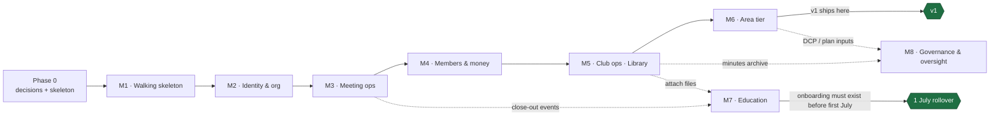

# Toastmasters Platform — Build Roadmap

The single source of truth for **how we build the platform, milestone by milestone, to production.**
Read `prd.md` for _what_ and _why_; read `system-design.md` for _how it's shaped_; read this for _in what order_ and _how we work_.

- Product spec: [`prd.md`](../prd.md) — requirement IDs are stable and quotable (e.g. `FR-AUTHZ-7`)
- System design: [`system-design.md`](../system-design.md) — architecture, data model, delivery plan (§24)
- Authorisation model: [`rbac-design.md`](../rbac-design.md) — the single gate, delegation, the access inspector
- Engineering rules: `CLAUDE.md` — **recommended companion to codify** (git identity, module boundaries, the 403 rule). Until it exists, the rules live in `system-design.md` §4.5 and §23.6.
- Deployment runbook: `docs/deployment.md` — **to be written before M1 ships to a real district**
- Per-milestone step-by-step plans: `docs/plans/`

---

## 1. Where we are

**Done:** the two design documents and the RBAC model. `prd.md` (v1.0), `system-design.md` (v2.0), and `rbac-design.md` are complete and internally traceable (PRD Appendix B). The milestone sequence, the invariants, and the authorisation model are decided on paper.

**Not started:** any code. There is no repository, no schema, no CI. This roadmap begins at a greenfield checkout.

**Blocking before we cut a single schema:** several **open decisions** (PRD §13 / design §25) are far cheaper to make now than after production data exists. These are **Phase 0** below and gate M1.

**Next:** close the Phase 0 decisions, stand up the platform skeleton, then build **M1 (walking skeleton).**

---

## 2. How we work (the method)

Every feature is built as a **vertical slice** and follows the same loop:

1. **Plan** — the slice is specified in its milestone plan (`docs/plans/mN-*.md`).
2. **Schema + seed + migration first** — edit the Prisma/Drizzle schema, add any new **seeded reference vocabulary** (resources, actions, paths, DCP goals, role templates — these are _data, never code_, per `FR-AUTHZ-1`/`FR-EDU-1`), and generate the migration in the same commit. Enforce append-only fields at the DB layer (`REVOKE UPDATE, DELETE`), not by convention (`NFR-4`).
3. **Wire the gate** — anything that touches a resource goes through `authorize()` (`FR-AUTHZ-6`) and adds its `(role × resource × action × scope)` rows to the generated matrix. Permission logic never lives in a route handler.
4. **Test first (TDD)** — write the failing service/unit test **and the 403 / negative-scope case** (`NFR-5`), then implement.
5. **Implement the slice** — respect the module boundaries in `system-design.md` §4.5: `/platform/db` is the only place queries live; `/app` never imports `/platform/db`; permission logic only in `/domain/access`. Repository → service → route (web), or job (worker), or aggregate method (domain).
6. **Verify** — `lint && typecheck && test && build` all green, **and** drive the real behaviour (run the meeting, curl the endpoint, click the page, roll the year), not just tests.
7. **Commit** — one logical change, Conventional Commits. _(The reference roadmap also mandates no AI attribution in commits — adopt if that's your policy.)_
8. **Checkpoint** — report what shipped and what's next; steer before the next slice.

### Definition of Done (per slice)

- [ ] Green gate (`lint` / `typecheck` / `test` / `build`).
- [ ] The **403 / wrong-scope case is tested**, not just the happy path, and the `(role × resource × action × scope)` matrix is updated (`NFR-5`).
- [ ] Every new access decision produces a **human-readable reason**; the access inspector covers the new resource (`FR-AUTHZ-7`) — for any authz-affecting slice.
- [ ] New ledger / audit / attendance / vote / inventory fields are **append-only at the DB layer** (`REVOKE UPDATE, DELETE`), not by convention (`NFR-4`).
- [ ] Sensitive resources (ledger, evaluations, member-health, audit) are **excluded from wildcard grants**, logged on read, and added to log redaction (`FR-AUTHZ-12`, `NFR-8`).
- [ ] New reference data is **seeded, editable without a deploy** — not a hardcoded list. New env in `packages/config` + `.env.example`; migration committed with the schema change.
- [ ] Behaviour demonstrated end-to-end.

### Non-negotiable guardrails (apply to every slice)

These are the ten product principles (PRD §3) made operational. They constrain every slice regardless of milestone.

- **Default deny, one gate.** Absence of a grant is a refusal; every decision flows through `authorize()`; **deny always beats allow** (`FR-AUTHZ-5/6`).
- **List endpoints filter at the query level** by scope and condition — never fetch rows and discard them, which leaks through pagination counts (`FR-AUTHZ-8`).
- **Facts are append-only.** Ledgers, audit events, attendance, votes, and inventory are corrected by _new_ records, never overwritten — enforced by the database (`NFR-4`).
- **Nothing depends on tenure.** Roles expire with terms; ended assignments grant nothing but are retained as history; the 1 July rollover loses no data (`FR-ORG-5/6`, principle 5).
- **Oversight sees aggregates, not individuals.** Area/division/district roles get counts and projections — never member names, dues status, or evaluation contents (`FR-OVS-3`, principle 9).
- **Signals coach, they do not judge.** Member-health and officer-activeness are private support tools, band-only upward, never a member-facing label or a public score (`FR-MEM-5`, principle 10).
- **TI is authoritative where TI is authoritative.** Never present a computed DCP status as official; never block a workflow on unverifiable TI state (`FR-TI-4`, principle 6).
- **Guests never authenticate.** Every guest interaction runs through the single **capability-token** primitive — hashed, expiring, revocable, revoked at meeting close (`FR-MEM-4`).
- **Grants are never hand-edited.** Every grant change goes through the audited surface (`FR-AUTHZ-11`).
- **Deadlines compute in the correct zone.** TI dues deadlines in Mountain Time, club meetings in the club's zone — never the viewer's local zone (`FR-ORG-8`).

---

## 3. Phase 0 — pre-flight (close before M1)

M1 must not start until these are resolved, because each is **cheap now and expensive after schemas or production data exist.**

### Decisions that gate the first schema (PRD §13 / design §25)

| # | Decision | Deadline | Why now |
|---|---|---|---|
| 1 | **PostgreSQL or a document store** | Before M1 | Several invariants (§19.3) are cheapest enforced by the DB; expensive to reverse after schemas exist. Design **recommends Postgres** (§4.4). |
| 6 | **Region tier above District?** | Before M1 | Free to include now, awkward to insert into the tree later. |
| 10 | **Single district or many; row-level vs DB-per-district** | Before production data | Structurally free, operationally expensive to retrofit. If heading toward multi-district, choose DB-per-district now (§4.6). |
| 4 | **Prospect retention window** | Before M1 (needed by M4) | Drives `deleteAfter` in the first prospect schema (`FR-MEM-3`). |
| 7 | **Local dues model** — flat semiannual / monthly / per-club | Before M4 | Shapes `DuesRecord` and proration (`FR-FIN-3`). |
| 2 | **Ballot anonymity** — anonymous or attributable | Before M3 | The two cannot coexist; changes the vote schema (§9.4). |
| 3 | **Club-creation authority** — must a portal club map to a chartered TI number? | Before M2 (org tree editor) | Affects validation. |
| 5 | **Audit retention period** | Before M2 (audit emission) | Storage planning + privacy notice. |
| 8 | **Installment plans permitted, and who approves** | Before M4 | Affects Treasurer workflow (§12.3). |
| 9 | **Minutes default visibility** — officers / members / public | Before M8 | Affects governance + library archive (§13.3). |

**Resolved since this table was written** — decisions 1 and 6 during the M1 walking skeleton; decisions 4, 7 and 8 on 2026-07-29, ahead of M4. The choice and rationale for each live in `CLAUDE.md` §2, the up-to-date record — this table is left as the original pre-flight snapshot rather than edited in place.

### Platform skeleton (stand up with / just before M1)

- Repository, package layout matching `system-design.md` §4.5, and CI enforcing **`/app` never imports `/platform/db`.**
- The stack, pinned: **Next.js App Router + TypeScript**, **PostgreSQL** (`ltree`, partial unique indexes, gapless sequences), **Prisma or Drizzle**, self-managed sessions (`jose` + Argon2id), **pg-boss / BullMQ**, S3-compatible / Cloudinary (signed URLs only), server-side PDF, `EmailPort` (console transport in dev). See §4.3.
- Structured logging with **correlation IDs on every line** and the metric/alert surface stubbed (`NFR-11`).
- Migrations-on-deploy and the seed harness for reference vocabularies.

---

## 4. Milestone overview

Dependency-ordered (design §24). Each milestone ends in something demonstrable. **v1 cut line is M1–M6.**

| # | Milestone | Theme | Ship gate (demo) |
|---|---|---|---|
| **M1** | Walking skeleton | Org tree, program year, identity, **one `authorize()`**, seeds, one meeting | A President creates a meeting and assigns a VPE; a member of another club **cannot see it** |
| **M2** | Identity & org | Invitations + delegation, unit policies, permission versioning, org editor, **access inspector**, audit emission | A district is built **top-down by invitation**, with no privilege-escalation path |
| **M3** | Meeting operations | Full meeting aggregate, agenda, slots, **offline meeting-day tools**, ballots, close-out | Run a real club meeting on the portal; a **wifi drop loses no timing** |
| **M4** | Members & money | Prospect pipeline, conversion, per-period dues, **append-only ledger**, invoices, financial reports | A guest **attends → converts → is invoiced → pays** |
| **M5** | Club operations | **Library (built early, on purpose)**, inventory with custody, content planner | Every officer has a working home for their module |
| **M6** | Area tier · **v1 line** | Visit reports, **dashboard led by visit compliance**, contact log, Club Success Plan, tickets | An **Area Director runs their year** |
| **M7** | Education | Level confirmation, role-requirement checking, evaluations, mentorship, **onboarding tracks** | A member completes a level; the VPE confirms; a new member is **paired and onboarded** |
| **M8** | Governance & oversight | ExCom, motions, minutes, **DCP projection**, division roll-up, health & activeness signals, cross-club support | Full **ExCom cycle**; district-level oversight |

### Dependency map

**Three sequencing calls worth defending (design §24):**

- **M1 is deliberately tiny and will feel like a detour.** Its only job is to make the permission model hurt at four routes rather than forty. **If `authorize()` feels awkward there, fix it before M2.**
- **The library is M5, not M8.** Six later contexts attach files (onboarding steps, content assets, governance documents, meeting handouts, receipts, published minutes). Building it late means retrofitting attachment points everywhere.
- **Onboarding tracks (M7) must land before the first July** run through the system. The officer-handover track has to exist _before_ the cohort that needs it, not in response to it struggling (`FR-EDU-7`). This constrains scheduling even though education is post-v1.

Deferred with least loss: education records (members use Base Camp today), DCP projection (TI publishes it daily and theirs is authoritative), cross-club support, activeness scoring. This ordering front-loads what TI does **not** provide.

---

## 5. Milestones in detail

Each block lists the milestone's **goal**, its **contents** (the slices), what it **depends on**, its **ship gate**, and **the one thing that must be right** — the guardrail or invariant this milestone exists to protect.

### M1 — Walking skeleton
- **Goal.** Prove the permission model at four routes before it spreads to forty.
- **Contents.** Org tree (`ltree`) + path maintenance · `ProgramYear` · `Person` / `ClubMembership` / `RoleAssignment` · login + session · **one `authorize()`** · seeded role templates, path catalogue, and resource/action vocabularies · one meeting with one role.
- **Depends on.** Phase 0 (DB choice, region tier, skeleton).
- **Ship gate.** A President creates a meeting and assigns a VPE; a member of another club cannot see it — the denial is a **query-level 403/404**, not a filtered-after-fetch.
- **Must be right.** `authorize()` is the single gate and reference vocabularies are seeded **data**. If the gate is awkward here, fix before M2 — this is the whole point of M1.
- **Traces.** `FR-ACC-1/6` · `FR-ORG-1/2/4` · `FR-AUTHZ-1…8`.

### M2 — Identity & org
- **Goal.** Build a district top-down by invitation, with delegation that cannot escalate.
- **Contents.** Invitations with delegation checks · unit policies + per-unit overrides · permission versioning (session counter, mid-session revocation) · org tree editor + transactional re-parenting · unit switcher · **`ActivityEvent` emission from here on** · the **access inspector**.
- **Depends on.** M1 (`authorize()` stable).
- **Ship gate.** A district is built top-down purely by invitation; an invitation carrying a role passes the **same delegation check** as a direct grant.
- **Must be right.** Invitations are never a privilege-escalation path (`FR-ACC-5`); grants change only through the audited surface (`FR-AUTHZ-11`); the **access inspector ships _with_ the engine** (`FR-AUTHZ-7`), never retrofitted.
- **Traces.** `FR-ACC-4/5/8/9/10` · `FR-ORG-3/5` · `FR-AUTHZ-9/10/11/12` · `NFR-6`.

### M3 — Meeting operations _(the core — G1)_
- **Goal.** Run a real club meeting end to end, surviving venue wifi.
- **Contents.** Full meeting aggregate · agenda builder + templates · speech-slot request/approval with path validation · printable agenda · live **timer / ah-counter / grammarian** · rotation suggestions (ranked, never automatic) · checklists · **capability tokens** · ballots · guarded close-out.
- **Depends on.** M1 identity/authz; the capability-token primitive.
- **Ship gate.** Run a real club meeting on the portal; a wifi drop mid-meeting loses no timing.
- **Must be right.** Meeting-day writes are offline-tolerant, idempotent, and replayed without duplication (`NFR-3`, `FR-MTG-6`); roles reference **identity, not strings** (`FR-MTG-2`); close-out is guarded and emits the education/DCP events (`FR-MTG-8`); award ballots are anonymous and hidden from guests **at the API layer** (`FR-MTG-7`).
- **Traces.** `FR-MTG-1…11` · `FR-MEM-4`.

### M4 — Members & money
- **Goal.** A guest attends, converts, is invoiced, and pays — money **recorded, never processed** (`N4`, no PCI scope).
- **Contents.** Prospect pipeline · conversion · **dues per membership per period** · append-only ledger · gapless invoices (PDF + email) · installments · **frozen** financial reports · public pages.
- **Depends on.** M3 (conversion from attendance/tokens), M1 identity.
- **Ship gate.** A guest attends → converts → is invoiced → pays; concurrent invoice creation never produces a gap or a duplicate number.
- **Must be right.** Ledger is append-only **at the DB** (`FR-FIN-2`); invoices are gapless per club per year (`FR-FIN-4`); standing is **derived by an explicit handler**, not a status flag (`FR-FIN-3`); prospect PII auto-expires (`FR-MEM-3`); the **handover financial report** gives the incoming Treasurer a trusted opening balance (`FR-FIN-8`).
- **Traces.** `FR-MEM-1/2/3/4` · `FR-FIN-1…8`.

### M5 — Club operations _(library first, deliberately)_
- **Goal.** Give every officer a working module home — and build the library **before** education and governance need it.
- **Contents.** **Library** (documents / media / links / notes as one model · versioning · review dates · signed URLs) · inventory (quantity derived from an append-only movement log · custody tracking) · content planner (plans and records only — no direct publishing).
- **Depends on.** M4 (receipts link to the ledger; signed-URL storage).
- **Ship gate.** Every officer has a working home for their module; a library item past its review date surfaces to its owner.
- **Must be right.** The library is M5 to avoid retrofitting attachment points across six contexts; uploads are served **only via signed URLs** (`FR-LIB-5`); inventory quantity is **derived, not stored** (`FR-OPS-2`); the content planner never publishes (`N5`).
- **Traces.** `FR-LIB-1…7` · `FR-OPS-1…4`.

### M6 — Area tier _(v1 cut line)_
- **Goal.** An Area Director runs their year on the dashboard they are actually measured on.
- **Contents.** `AreaVisitReport` (six Moments of Truth, R1/R2) · **Area dashboard led by visit compliance** (the 75% thresholds) · President-contact log · Club Success Plan (live, rendered against the DCP projection) · tickets (role-tagged, jurisdiction-visible) · health snapshots.
- **Depends on.** M1 scoping (oversight = aggregates only), M4 (club health inputs).
- **Ship gate.** An Area Director runs their year; the dashboard **leads with visit compliance, not attendance** — a dashboard that shows attendance but not compliance has missed the job (`FR-OVS-6`).
- **Must be right.** Oversight sees **aggregates, never member detail** (`FR-OVS-3`); tickets tag **roles as well as people** so they survive the handover (`FR-OVS-1`).
- **Traces.** `FR-OVS-1…7` · `FR-GOV-6`.
- **This is where v1 ships.** Per-person login, correct hierarchy with working delegation, full meeting operations, guests, dues, treasury, invoicing, every officer's module home, tickets, and an Area dashboard.

### M7 — Education _(post-v1 — but onboarding before the first July)_
- **Goal.** A member completes a level, the VPE confirms, a new member is paired and onboarded.
- **Contents.** Education records · two-step level confirmation · role-requirement checking from close-out events · evaluations (three modes, metric snapshot at evaluation time) · mentorship (ranked suggestions, never automatic) · **onboarding tracks** (auto-enrol on guest-converted / officer-assigned / year-rolled).
- **Depends on.** M3 close-out events; M5 library (onboarding steps attach files).
- **Ship gate.** A member completes a level; the VPE confirms; a new member is paired and onboarded.
- **Must be right.** Completion comes from **close-out events, not self-report**; only the **VPE-confirmed date feeds DCP** (`FR-EDU-2/3`); evaluations are visible to the speaker and VPE only by default (`FR-EDU-5`); **onboarding tracks must exist before the first July** (`FR-EDU-7`) — schedule accordingly even though this is M7.
- **Traces.** `FR-EDU-1…7`.

### M8 — Governance & oversight
- **Goal.** A full ExCom cycle and district-level oversight.
- **Contents.** ExCom meetings · motions with **attributable** votes · self-drafting minutes · **DCP projection** (nightly, each goal traceable, always labelled "Projected") · division roll-up · member-health signals · cross-club support · officer activeness scoring.
- **Depends on.** M5 library (minutes archive), M6 (Club Success Plan / DCP inputs), **calibration** before signals ship.
- **Ship gate.** Full ExCom cycle; district-level oversight.
- **Must be right.** Governance votes are **attributable**, meeting ballots are **anonymous** — different activities, different rules; health and activeness are **private, band-only, and shipped after calibration** (principle 10); DCP is **always a projection, never official** (`FR-OVS-5`, `FR-TI-4`).
- **Traces.** `FR-GOV-1…6` · `FR-OVS-5` · `FR-SUP-1…3` · §23.1.

---

## 6. Cross-cutting workstreams

These span every milestone; each milestone plan calls out its portion.

- **Testing** (`system-design.md` §23.6). Unit (aggregate invariants, permission evaluation, DCP calculation, dues proration, installment sums, rotation ranking) · integration against a **real Postgres** (transactions included) · the **authorisation matrix** — every `(role × resource × action × scope)` generated from role templates and asserted against `authorize()`, _the single most valuable suite in the project_ (`NFR-5`) · contract (API vs published schema) · e2e (run a meeting, onboard a district, roll a year, settle an invoice, publish minutes) · **nightly data-consistency jobs** (path consistency, inventory reconciliation, invoice gap detection, orphan detection, singleton-role verification).
- **Authorisation & audit** (§7, §23.1, `rbac-design.md`). The single gate, the access inspector, and an **immutable audit event** with actor/target/before-after diff on every state change and every break-glass access (`NFR-6`). Watch the guardrail metric: a climbing count of direct grants and per-unit overrides means the role templates are wrong (PRD §4.2).
- **Observability** (`NFR-11`). Structured JSON logs with **correlation IDs on every line**; metrics on authorisation denials, job failures, token redemptions, login failures, and PDF generation; alerts on projection/snapshot/signal job failure, path-consistency failure, inventory drift, denial spikes, and email failure.
- **Security** (`NFR-7`). Argon2id + breach-list check; TOTP MFA optional for members, **required for system administrators**; httpOnly/Secure/SameSite sessions revocable via permission version; HTTPS/HSTS; parameterised queries only; upload type/size validation + virus scanning; **signed-URL storage only**.
- **Privacy** (`NFR-8`). Per-person export and deletion where deletion **anonymises** ledger/invoice/minutes/audit rather than removing them (financial and governance integrity outrank erasure); coarse, opt-in, separately consented location; evaluations and health restricted by default; prospect PII auto-expiry.
- **Reliability & the rollover** (`NFR-2/3/10`, `FR-ORG-6`). 99.5% overall, with weekday-evening meeting windows the only critical period; offline meeting-day replay (idempotent); nightly backup + PITR (**RPO 1h / RTO 4h**), restore tested quarterly. The **1 July rollover job** — close the year, end term roles, snapshot outcomes, generate handover reports, open the new year, seed plans, enrol incoming officers — is the single most important reliability event and must exist before the first July.
- **Deployment** (`docs/deployment.md`, to be written). Single region nearest the district; migrations on deploy; `EmailPort` console transport in dev; per-unit feature flags so a pilot club can trial a capability before district rollout (`NFR-13`).

---

## 7. Using these docs

- Start a milestone → open its plan in `docs/plans/` (`mN-*.md`).
- Each plan is a checklist of **slices**; each slice lists steps, files, tests, and its Done-when.
- Check a box only when it's **true and verified.** Keep the plan and reality in sync — if we deviate, edit the plan in the same commit.
- This roadmap changes rarely; the milestone plans are living documents.
- When a Phase 0 decision is made, record it (owner + date + choice) so the "why" survives the handover — the same durability the platform gives its own users.
