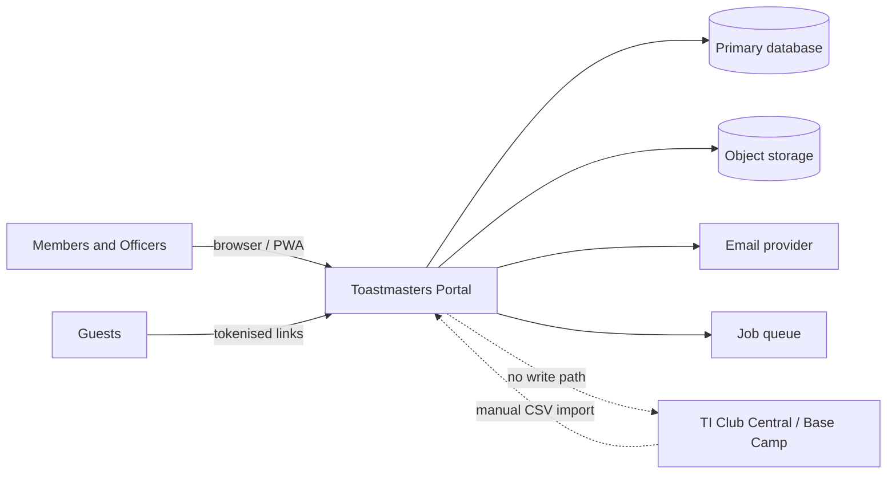
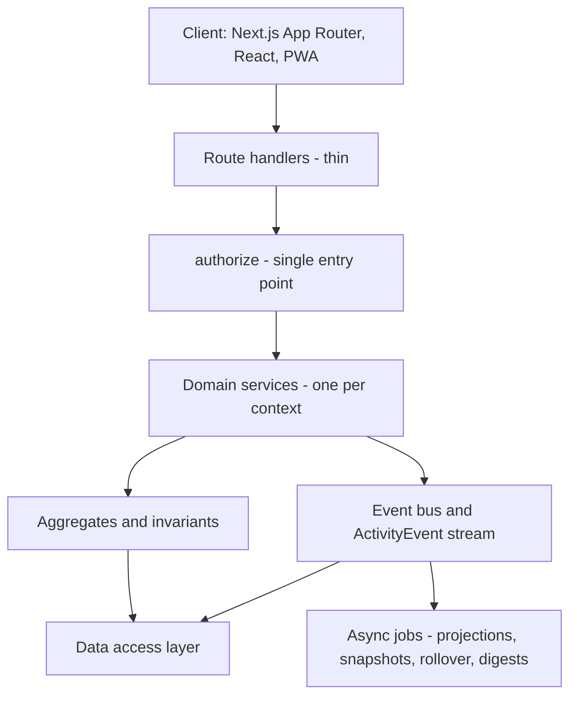
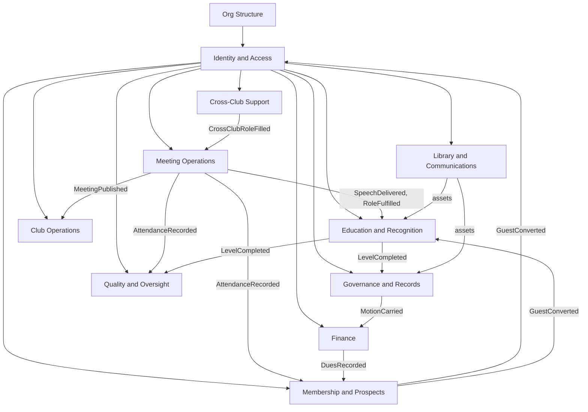

# Toastmasters Club Management Platform — System Design

**Version:** 2.0 · **Date:** 2026-07-27 · **Status:** For review

Complete specification. Every club module, officer domain, and platform concern.

---

## Contents

**Part I — Foundation** · 1. Purpose and principles · 2. Domain primer · 3. Actors · 4. Architecture

**Part II — Core model** · 5. Organisation and time · 6. Identity and membership · 7. Authorisation

**Part III — Domain contexts** · 8. Context map · 9. Meeting operations · 10. Education and recognition ·
11. Membership and prospects · 12. Finance · 13. Governance and records · 14. Club operations ·
15. Library and communications · 16. Quality and oversight · 17. Cross-club support · 18. TI boundary

**Part IV — Implementation** · 19. Data model · 20. API design · 21. Workflows · 22. Interface surface ·
23. Cross-cutting concerns · 24. Delivery plan · 25. Open decisions · Appendix A — Module index

---

# Part I — Foundation

## 1. Purpose, goals and principles

A web platform for running Toastmasters clubs and the district structure above them: meeting
operations, member education, guest pipelines, club finances, records, resources, and oversight from
Area, Division and District leadership.

### 1.1 Goals

| # | Goal |
|---|---|
| G1 | Run a club meeting end-to-end: agenda, roles, speeches, timing, evaluations, attendance, awards |
| G2 | Model the real TI hierarchy — District → Division → Area → Club — with permissions that follow containment |
| G3 | One login per human, valid across every club and office they hold |
| G4 | Survive the annual leadership handover with zero data loss and zero manual archiving |
| G5 | Give Area and Division Directors the reports they are actually measured on |
| G6 | Track member educational progress against Pathways requirements |
| G7 | Manage the guest → member funnel and club-local finances |
| G8 | Give every club officer a working home for their own module — records, resources, inventory, content |

### 1.2 Non-goals

| # | Non-goal | Why |
|---|---|---|
| N1 | Replacing TI's Club Central or Base Camp | No public write API; TI stays authoritative for membership, WHQ dues, education awards |
| N2 | Multi-tenant SaaS isolation | Single district, single deployment. Separation between clubs is authorisation, not tenancy. Full breakdown of what this does and does not include: §4.6 |
| N3 | Speech contest management | Distinct domain, seasonal, low reuse |
| N4 | Payment processing | Record payments, don't take them. Removes PCI scope entirely |
| N5 | Direct social media publishing | Per-platform OAuth and constant API breakage; disproportionate for volunteer clubs. Plan and record instead (§15.4) |
| N6 | Video conferencing | Link out |

### 1.3 Constraints

- No integration API from TI. TI data arrives by manual entry or CSV import.
- Users are unpaid volunteers who rotate annually. Every workflow must be learnable in one sitting.
- Meeting-day tools run on phones on unreliable venue wifi.
- Officers change every 1 July. Nothing may depend on a person's continued tenure.

### 1.4 Design principles

1. **Time is a dimension, not an afterthought.** Every operational record belongs to a program year.
2. **Identity ≠ membership ≠ office.** Three concepts, three records.
3. **Hierarchy is a tree, not four tables.** Scope checks are prefix matches.
4. **Anything TI can change is data, not code.** Paths, DCP goals, evaluation criteria, role templates.
5. **Facts are append-only.** Ledgers, audit events, attendance and inventory are corrected by new records, never overwritten.
6. **Default deny.** Absence of a grant is a refusal.
7. **One authorisation function.** Not twelve drifting checks.
8. **One model per concept, many views.** Documents, media and links are one library, filtered — not three stores.

---

## 2. Domain primer — Toastmasters International

Ground truth. Everything downstream depends on getting this right.

### 2.1 Hierarchy

```
Toastmasters International (World HQ + Board)
└── Region                (14 worldwide)
    └── District          (District Trio + 3 more officers)
        └── Division      (typically 4–6 Areas)
            └── Area      (3–8 Clubs, commonly 4–6)
                └── Club  (min 8 members in good standing; 20 to charter)
                    └── Member
```

### 2.2 Leadership

| Level | Roles |
|---|---|
| **Club** (Executive Committee) | President, VP Education, VP Membership, VP Public Relations, Secretary, Treasurer, Sergeant at Arms — **7 officers** — plus **Immediate Past President** |
| **Area** (Area Council) | Area Director; optionally Assistant Area Director Program Quality, Assistant Area Director Club Growth, Area Secretary |
| **Division** (Division Council) | Division Director; optionally Assistant Division Director Program Quality / Club Growth |
| **District** | District Director, Program Quality Director, Club Growth Director (the "Trio"), plus Public Relations Manager, Administration Manager, Finance Manager |

All terms run **1 July – 30 June**.

### 2.3 The calendar

| Cycle | Dates |
|---|---|
| Program year | 1 Jul – 30 Jun |
| Dues — April period | Membership 1 Apr – 30 Sep; due 1 Apr; must reach WHQ by 31 Mar |
| Dues — October period | Membership 1 Oct – 31 Mar; due 1 Oct; must reach WHQ by 30 Sep |
| Officer training round 1 | ~Jun–Aug |
| Officer training round 2 | ~Dec–Feb |
| Area visit round 1 | Report due 30 Nov |
| Area visit round 2 | Report due 31 May |
| Club Success Plan | Due 30 Sep |

International dues are **semiannual** — currently 60 USD per six-month period (72 USD from 3 Aug
2026), plus a one-time 25 USD new member fee, prorated by join month. Clubs may charge separate local
dues.

### 2.4 Membership types and standing

| Type | Counts toward DCP membership goals |
|---|---|
| New, Renewing, Dual, Reinstated | Yes |
| Charter | Toward total count only |
| Transfer, Honorary | **No** |

**Club good standing:** ≥8 paid members, of whom ≥3 were members in the previous renewal period.
Below that, status moves Active → Low → Ineligible.

Two independent notions of "active" must be modelled separately: **TI standing** (dues paid to WHQ)
and **club-local participation** (attendance or a club decision).

### 2.5 Distinguished Club Program

Ten goals, assessed 1 Jul – 30 Jun.

| # | Area | Goal |
|---|---|---|
| 1 | Education | Four Level 1 awards |
| 2 | Education | Two Level 2 awards |
| 3 | Education | Two more Level 2 awards |
| 4 | Education | Two Level 3 awards |
| 5 | Education | One Level 4, Level 5 or DTM award |
| 6 | Education | One more Level 4, Level 5 or DTM award |
| 7 | Membership | Four new, dual or reinstating members |
| 8 | Membership | Four more new, dual or reinstating members |
| 9 | Training | ≥4 club officer roles trained in **each** of the two training periods |
| 10 | Administration | On-time dues for 8 members (≥3 renewing) for one period, **and** on-time officer list submission |

**Qualifying requirements** (independent of goal count): club in good standing; **Club Success Plan
submitted by 30 September**.

| Recognition level | Goals | Membership |
|---|---|---|
| Distinguished | 5 | net growth of 5, or 20 members |
| Select Distinguished | 7 | 20 paid members or net growth of 5 |
| President's Distinguished | 9 | 20 paid members |
| Smedley Distinguished | 10 | 25 members |

### 2.6 Distinguished Area Program

The Area Director's measurable obligations:

- Visit every club **at least twice a year**; file an **Area Director's Club Visit Report** per visit,
  structured around the **six Moments of Truth** club-quality standards.
- Qualifying: reports for **≥75% of club base** by **30 Nov**, and ≥75% by **31 May**.
- **No net club loss.**
- Hold ≥2 Area Council meetings; contact club Presidents monthly about DCP.

An Area dashboard that shows attendance charts but not visit compliance has missed the job.

### 2.7 Pathways

- Each path has **5 levels**; each level contains several projects. Base Camp is TI's LMS.
- The catalogue changes — specialised paths plus "vintage" paths added in 2026 (Basic Training → **BT**;
  The Communication Series → **CES**). **Never hardcode the path list.**
- All club officers are Base Camp Managers.
- **Critical:** progressing each level now requires completing **designated meeting roles**, and at
  **Levels 3–5** members must deliver presentations from the **Toastmasters Education Series**.

That makes meeting-role tracking educationally load-bearing, not cosmetic.

### 2.8 Meeting anatomy

| Role | Function |
|---|---|
| Toastmaster of the Day | Hosts; introduces segments and speakers |
| Prepared Speaker ×n | Delivers a Pathways project speech |
| Individual Evaluator ×n | Evaluates one prepared speech |
| General Evaluator | Evaluates the meeting overall; leads the evaluation team |
| Table Topics Master | Runs impromptu speaking |
| Table Topics Evaluator | Evaluates impromptu speakers |
| Timer | Times every segment; signals green/amber/red |
| Ah-Counter | Counts filler words and hesitations |
| Grammarian | Word of the Day; notes language use and errors |
| Sergeant at Arms | Room setup, guests, calls to order |

Outputs: printable agenda, timing report, ah-counter report, grammarian report, evaluations, Best
Speaker / Table Topics / Evaluator ballots, attendance.

### 2.9 Glossary

| Term | Meaning |
|---|---|
| **DCP** | Distinguished Club Program |
| **DTM** | Distinguished Toastmaster, the highest education award |
| **Base Camp** | TI's learning management system for Pathways |
| **Club Central** | TI's club administration portal |
| **Moments of Truth** | Six standards of club quality used in visit reports |
| **Program year** | 1 July – 30 June |
| **Club base** | Number of clubs in an area/division/district at year start |
| **ExCom** | Club Executive Committee |
| **Functionary** | Timer, Ah-Counter, Grammarian — supporting meeting roles |
| **Dual member** | A person holding membership in two or more clubs |

---

## 3. Actors

| Actor | Primary jobs |
|---|---|
| **Member** | See my next role; request a speech slot; read my evaluations; track Pathways progress; pay dues; find a mentor |
| **VP Education** | Fill roles for upcoming meetings; approve speech slots; confirm level completions; rotate roles fairly; assign mentors; run onboarding |
| **VP Membership** | Work the guest pipeline; convert prospects; act on at-risk members |
| **President** | Monitor club health and DCP; manage officer roster; own the Club Success Plan; chair ExCom |
| **Secretary** | Attendance; ExCom and club minutes; document archive; club records |
| **Treasurer** | Dues per period; ledger; invoices; installments; financial reports |
| **VP Public Relations** | Public page; content calendar; media library; external links |
| **Sergeant at Arms** | Meeting logistics and checklists; inventory; club costs |
| **Area Director** | Visit clubs and file reports; monthly President contact; council meetings; defend club count |
| **Division Director** | Roll up areas; assign clubs to areas; reassign Area Directors |
| **District Director / Trio** | District-wide oversight; officer roster; club growth |
| **Guest / Prospect** | Attend; fill a functionary role; register interest — **without an account** |
| **System Administrator** | Build the org tree; manage role templates; break-glass support |

---

## 4. Architecture

### 4.1 System context



The dotted TI edge is deliberate: import only, human-mediated, never automatic.

### 4.2 Layers



Route handlers contain no business logic and never touch the data layer. Every mutation flows through
a domain service. Every service emits domain events.

### 4.3 Stack

| Concern | Choice | Rationale |
|---|---|---|
| Framework | **Next.js (App Router) + TypeScript** | Server components suit heavily role-conditioned UIs; one deployable |
| Database | **PostgreSQL** (recommended) | `ltree` for hierarchy, partial unique indexes for term invariants, revocable `UPDATE`/`DELETE` for append-only ledgers, native transactions, gapless sequences for invoices. See §4.4 |
| ORM | Prisma or Drizzle | Typed schema, migrations |
| Auth | Self-managed sessions (`jose` JWT + httpOnly cookie), Argon2id | The authorisation model is unusual enough that off-the-shelf auth fights you |
| Jobs | pg-boss / BullMQ | Durable, same store |
| Object storage | S3-compatible or Cloudinary | Signed URLs only |
| PDF | Server-side render (invoices, reports, agendas, minutes) | Frozen artefacts, not live queries |
| Email | Provider behind an `EmailPort` | Swappable; console transport in dev |
| Hosting | Single region nearest the district | Latency and data residency |

### 4.4 Database choice

Relational fits better, and the reasons are concrete:

| Requirement | Postgres | Document store |
|---|---|---|
| Hierarchy prefix queries | `ltree` + GiST index, purpose-built | String regex on a materialised path |
| One active President per club per year | `UNIQUE INDEX … WHERE status='active'` | Application code |
| Append-only ledger and inventory | `REVOKE UPDATE, DELETE` — enforced by the DB | Convention |
| Gapless invoice numbering | Sequence table + row lock | Application-level race risk |
| One vote per person per ballot | `UNIQUE (ballot_id, voter_hash)` | Check inside a transaction |
| Multi-entity transactions (invitation accept writes person + membership + role) | Native | Requires replica set |
| Flexible payloads (evaluation forms, event diffs, minutes bodies) | `jsonb` | Native |

A document store is workable if the team is materially faster in it — every schema below maps cleanly.
But the invariants in §19.3 are the heart of this system, and having the database enforce them rather
than the test suite is worth a lot. **Decide before the first schema.**

### 4.5 Module structure

```
/domain
  /org            OrgUnit, ProgramYear, ClubProfile
  /identity       Person, ClubMembership, RoleAssignment, Invitation
  /access         authorize(), RoleTemplate, UnitPolicy, canDelegate()
  /meeting        Meeting aggregate, roles, speech slots, attendance, ballots, checklists
  /education      PathCatalog, EducationRecord, SpeechEvaluation, Mentorship, Onboarding
  /membership     Prospect pipeline, conversion, health signals
  /finance        LedgerEntry, DuesRecord, Invoice, InstallmentPlan, FinancialReport
  /governance     ExComMeeting, Motion, Minutes, ClubSuccessPlan
  /operations     InventoryItem, ChecklistTemplate
  /library        LibraryItem, ContentPlanItem
  /quality        Ticket, AreaVisitReport, DcpProjection, HealthSnapshot
  /support        SupportProfile, SupportRequest
/platform
  /db             data access — the only place queries live
  /events         publish/subscribe, ActivityEvent writer
  /auth           sessions, passwords, capability tokens
  /notify         channels, templates, digests
  /docs           PDF rendering
/app              routes and UI — thin
```

CI rule: nothing under `/app` imports from `/platform/db`.

### 4.6 Tenancy posture — what is and is not covered

"Multi-tenant" means two different things and the design deliberately does one of them.

**Covered — multi-club data separation.** Many clubs live in one system and cannot see each other's
data. This is delivered by the org tree (§5.1) plus the authorisation engine (§7): every club-scoped
row carries `orgUnitId`, every read passes a prefix-scope check, and the default is deny. A VPM of
Club A cannot list Club B's prospects, read its ledger, or see its evaluations. Cross-club visibility
exists only where a grant explicitly allows it — an Area Director over their own area, for example.

**Not covered — SaaS tenant isolation.** These are the operational guarantees you would owe paying
customers who are strangers to one another:

| Capability | Status | What it would take |
|---|---|---|
| Per-tenant backup and point-in-time restore | ✗ | Per-district logical backup sets; restore tooling that can rebuild one district without touching others |
| Data residency per tenant | ✗ | Region-pinned deployments or database-per-district |
| Tenant lifecycle — provision, suspend, offboard, export-and-delete | ✗ | A tenant registry, an export pipeline, a hard-delete path that respects §23.4 anonymisation rules |
| Cross-tenant test matrix in CI | ✗ | Generated tests asserting every route returns 403/404 across a tenant boundary |
| Per-tenant rate limits and quotas | ✗ | Limit buckets keyed by tenant, not just by user |
| Per-tenant branding and configuration | Partial | `ClubProfile.publicPage` exists; no theming or per-district config layer |
| Per-tenant encryption keys | ✗ | Envelope encryption with a key per tenant |
| Tenant-level billing and usage metering | ✗ | Out of scope entirely (N4) |
| Noisy-neighbour isolation | ✗ | Connection pool partitioning, per-tenant job queues |

**Why it was excluded:** you specified a single district, single deployment. Under that assumption the
isolation work above is cost without benefit — a permission bug is a bug, not a breach across
customers, and the blast radius is one organisation that already shares a district council.

**If that assumption has changed, decide now.** The org tree makes the *structural* part free: add a
`district` root per customer and prefix scoping keeps working unchanged. What is not free is the
operational column above, and one choice in particular is much cheaper before production data exists:

> **Row-level tenancy vs database-per-district.** Row-level (the current design) is simpler and fine
> for one district or a handful of friendly ones. Database-per-district gives real isolation, trivial
> per-tenant restore, and straightforward data residency — and it is far easier to adopt before there
> is data to migrate than after. If this is heading toward a product sold to multiple districts, choose
> database-per-district now and route by tenant at connection time.

This is open decision 10 (§25).

---

---

# Part II — Core model

## 5. Organisation and time

### 5.1 The org tree

One recursive structure, not four sibling tables.

```ts
type OrgUnitType = "international" | "region" | "district" | "division" | "area" | "club";

interface OrgUnit {
  id:          UUID;
  type:        OrgUnitType;
  parentId:    UUID | null;
  path:        string;    // materialised: "d41.divA.area3.c1234"  (ltree)
  depth:       number;
  name:        string;
  code:        string;    // "41" · "A" · "3" · "1234"
  status:      "active" | "low" | "ineligible" | "suspended" | "dissolved";
  charteredAt: Date | null;
  timezone:    string;    // IANA, e.g. "Asia/Dhaka"
  createdAt:   Date;
  updatedAt:   Date;
}
```

**Why one tree:**

- Recursive visibility is one query. Everything a Division Director can see is
  `WHERE path <@ 'd41.divA'`. With separate tables it is a four-way join written differently at each
  level, and it breaks the first time someone asks for a Region.
- Re-parenting works. Clubs move between areas at redistricting; Division Directors reassign clubs.
  One `parentId` write plus a subtree path rewrite.
- Depth is configurable. A district-only deployment roots at `type: "district"`. (This deployment
  always roots at `region` — see `CLAUDE.md` §2, Phase-0 decision 6.)

**Path maintenance is transactional.** On create, `path = parent.path || code`. On re-parent, rewrite
the node and every descendant in one transaction, emit `OrgUnitReparented`, invalidate permission
caches under both old and new paths.

*Trade-off:* materialised paths make reads cheap and re-parenting expensive; a closure table inverts
that. Re-parenting happens at most annually. Materialised path wins.

```ts
interface ClubProfile {                  // 1:1 with a club node
  orgUnitId:    UUID;
  tiClubNumber: string;
  charterDate:  Date;
  schedule:     Array<{ dayOfWeek: 0-6; startTime: "18:30"; durationMin: number;
                        cadence: "weekly" | "biweekly" | "monthly" }>;
  format:       "in_person" | "online" | "hybrid";
  venue:        { name; addressLine; city; country; geohash };
  joinUrl:      string | null;
  localDues:    { amount; currency; periodicity: "semiannual" | "monthly"; notes };
  publicPage:   { slug: string; blurb: string; isPublished: boolean };
  healthThresholds: {                    // §11.3 — club-configurable
    atRiskDaysSinceAttendance: number;   // default 42
    watchAttendanceRatePct: number;      // default 50
  };
}
```

### 5.2 Program year

```ts
interface ProgramYear {
  id:     "2026-2027";
  start:  "2026-07-01";
  end:    "2027-06-30";
  duesPeriods: [
    { code: "2026-OCT", memberFrom: "2026-10-01", memberTo: "2027-03-31",
      dueBy: "2026-10-01", whqDeadline: "2026-09-30" },
    { code: "2027-APR", memberFrom: "2027-04-01", memberTo: "2027-09-30",
      dueBy: "2027-04-01", whqDeadline: "2027-03-31" }
  ];
  trainingPeriods:  [{ code: "R1"; from; to }, { code: "R2"; from; to }];
  areaVisitRounds:  [{ code: "R1"; dueBy: "2026-11-30" },
                     { code: "R2"; dueBy: "2027-05-31" }];
  clubSuccessPlanDueBy: "2026-09-30";
  status: "upcoming" | "current" | "closed";
}
```

**Rules:**

1. Every operational record carries `programYearId`.
2. Closing a year makes its records read-only — never deleted. This delivers the annual-handover
   guarantee structurally rather than through per-aggregate archiving.
3. Dashboards default to `current`, with a year selector.
4. Rollover on 1 July is an automated job (§21.3), not something an officer must remember.

**Timezones.** Club meeting times are local to the club (`OrgUnit.timezone`). TI dues deadlines are
Mountain Time. Store instants in UTC; render in the relevant zone; never compute a deadline in the
viewer's local zone.

---

## 6. Identity and membership

Three concepts routinely conflated, which must not be:

| Concept | Question | Lifetime |
|---|---|---|
| **Person** | Who is this human? | Forever; one per human |
| **ClubMembership** | Which clubs, in what standing? | Years; many per person |
| **RoleAssignment** | What office, where, which term? | One program year; many per person |

### 6.1 Schemas

```ts
interface Person {
  id:             UUID;
  email:          string;      // globally unique, lowercased — the login
  passwordHash:   string | null;
  fullName:       string;
  phone:          string | null;
  photoUrl:       string | null;
  bio:            string | null;
  tiMemberNumber: string | null;
  status:         "invited" | "active" | "disabled";
  mfaEnabled:     boolean;
  permissionVersion: number;   // bumped on any grant change
  createdAt: Date; lastLoginAt: Date | null;
}

interface ClubMembership {
  id:          UUID;
  personId:    UUID;
  clubUnitId:  UUID;
  memberType:  "new" | "renewing" | "dual" | "reinstated" | "charter" | "transfer" | "honorary";
  joinedAt:    Date;
  leftAt:      Date | null;
  isPrimary:   boolean;        // home club
  tiStanding:  "good" | "lapsed" | "unknown";
  localStatus: "active" | "inactive" | "on_leave" | "suspended";
  provenance:  "portal" | "ti_import";
  lastReconciledAt: Date | null;
}

interface RoleAssignment {
  id:            UUID;
  personId:      UUID;
  orgUnitId:     UUID;
  role:          RoleKey;
  programYearId: string;
  termStart:     Date;
  termEnd:       Date;
  status:        "pending" | "active" | "ended" | "revoked";
  appointedBy:   UUID;
  appointedAt:   Date;
  trainedAt:     Array<{ period: "R1" | "R2"; at: Date }>;   // DCP goal 9
  endedReason:   "term_end" | "resigned" | "removed" | "succeeded" | null;
}
```

`trainedAt` is small but load-bearing: DCP Goal 9 requires four officers trained in each of two
periods, and clubs routinely lose the goal because nobody recorded it.

### 6.2 Why the split matters

- **Dual membership works.** One `Person`, two `ClubMembership`s. TI supports dual members and counts
  them toward DCP goals.
- **Directors need club membership without duplicate identity.** TI requires Area, Division and
  District Directors to be club members — a validation rule on appointment, not a structural dependency.
- **A person can hold several offices.** Multiple `RoleAssignment` rows — Club VPE and Area Director
  simultaneously is common.
- **The handover is free.** Last year's assignments sit with `status: "ended"`. "Who was President in
  2024–25?" is a query.
- **Cross-club participation is expressible.** A member of Club A filling Timer at Club B is a role
  assignment referencing a person with no membership there.

### 6.3 Bootstrapping a district

No placeholder tree, no retro-assignment:

```
1. Admin creates OrgUnit(district).                    — no people involved
2. Admin invites a Person by email with intent { unit, roles }.
3. Person accepts, sets a password.                    — Person.status → active
4. Person is granted a ClubMembership (any club).
5. RoleAssignment activates.
```

Steps 4 and 5 have no ordering dependency on 2 and 3.

```
INVARIANT  DirectorRequiresClubMembership
  A RoleAssignment for a district-tier role (area_director, division_director,
  district_director, program_quality_director, club_growth_director, …) is valid only
  while the person holds ≥1 ClubMembership with localStatus = "active".

  On create:  surfaced as a task on the invitee's own dashboard — never as a block on
              accepting the invitation, since blocking leaves them unable to log in and fix it.
  Ongoing:    if the last active membership ends, raise EligibilityWarning to the appointing
              authority. Do NOT auto-revoke.
```

An invariant that silently strips a District Director's access because a treasurer mis-clicked is a
production incident. Make it loud and human-resolved.

### 6.4 Invitations

```ts
interface Invitation {
  id:        UUID;
  email:     string;
  tokenHash: string;          // store the hash, never the token
  expiresAt: Date;            // 7 days
  invitedBy: UUID;
  intent: {
    orgUnitId:  UUID;
    membership: { memberType } | null;
    roles:      Array<{ role: RoleKey; programYearId: string }>;
  };
  status:    "pending" | "accepted" | "expired" | "revoked";
  acceptedAt: Date | null;
  acceptedPersonId: UUID | null;
}
```

**Accept semantics — create *or attach*.** If the email is unknown, create a `Person`; if known,
attach. That single branch is how a member of Club A joins Club B without a second account, and how a
district officer is appointed without duplicate identity.

Hardening: constant-time token comparison; rate-limit invitation creation per inviter per day;
invitations carrying roles pass the same delegation check as a direct grant, or they become a
privilege-escalation path.

### 6.5 Sessions

```ts
interface SessionClaims {
  sub:           string;   // personId
  activeUnitId:  string;
  programYearId: string;
  v:             number;   // permission version
  act?:          { sub: string; reason: string };   // impersonation
  iat: number; exp: number;
}
```

**Do not embed the permission set in the token.** It is large, it changes mid-session (a President
appoints you VPE; you should not have to log out), and it cannot be revoked. Carry a version counter;
resolve permissions server-side into a short-TTL cache; bump `v` on any grant change.

**Unit switching** changes `activeUnitId` and nothing else. Re-issue the token; never trust a
client-supplied unit id.

**Impersonation** must be a distinct claim, time-boxed, reason-required, visibly banded, logged on
every request.

---

## 7. Authorisation

### 7.1 Model and evaluation

```ts
interface Grant {
  scopePath: string;   // "d41.divA" — this node and all descendants
  resource:  string;
  action:    "read" | "create" | "update" | "delete" | "approve" | "export";
  effect:    "allow" | "deny";
  fields?:   string[];
}
```

```
effectiveGrants(person) =
    platformRoleGrants
  ∪ roleTemplateGrants(active RoleAssignments)
  ∪ unitPolicyOverrides
  ∪ directPersonGrants

authorize(person, resource, action, targetUnit):
    candidates = effectiveGrants(person)
        .filter(g => targetUnit.path is within g.scopePath)
        .filter(g => g.resource matches && g.action matches)
    if any candidate.effect == "deny"  → DENY      // deny always wins
    if any candidate.effect == "allow" → ALLOW
    else                               → DENY      // default deny
```

Three load-bearing properties: **deny wins** (otherwise a club override can never remove anything);
**default deny**; **scope as prefix test**, which is why §5.1 materialises the path.

### 7.2 Role taxonomy

Platform roles and domain roles are separate axes that compose. Collapsing them into one enum is what
forces the "one role per member" limitation.

```ts
type PlatformRole = "system_admin" | "unit_admin" | "support_readonly";

type DomainRole =
  | "club_president" | "club_ipp" | "club_vpe" | "club_vpm" | "club_vppr"
  | "club_secretary" | "club_treasurer" | "club_saa" | "club_member"
  | "area_director" | "asst_area_director_pq" | "asst_area_director_cg" | "area_secretary"
  | "division_director" | "asst_division_director_pq" | "asst_division_director_cg"
  | "district_director" | "program_quality_director" | "club_growth_director"
  | "public_relations_manager" | "administration_manager" | "finance_manager"
  | "district_ipdd"
  // District-appointed roles that operate INSIDE a club (§7.8)
  | "club_sponsor" | "club_mentor" | "club_coach"
  // Only if the Region tier is materialised (open decision 6)
  | "region_advisor";
```

Two constraints: **unit-type compatibility** (`club_vpe` only on a club node; `area_director` only on
an area node) and **singleton enforcement** (one active `club_president` per club per year), which
belongs in a partial unique index, not application code.

A guest is deliberately **not** a role. Guests do not authenticate.

### 7.3 Role templates are data

```ts
interface RoleTemplate {
  role:      RoleKey;
  scopeRule: "self_unit" | "self_subtree";
  grants:    Omit<Grant, "scopePath">[];
  isSystem:  boolean;
}
```

Seeded rows, editable by a system administrator. `scopeRule: "self_subtree"` lets an Area Director see
every club beneath their area without enumeration. Because templates are data, a permission can be
corrected across all clubs without a deploy.

### 7.4 Per-unit overrides and delegation

```ts
interface UnitPolicy {
  orgUnitId: UUID;
  overrides: Array<{
    subject: { kind: "role"; role: DomainRole } | { kind: "person"; personId: UUID };
    grants:  Omit<Grant, "scopePath">[];
  }>;
  updatedBy: UUID; updatedAt: Date;
}
```

```
canDelegate(actor, grant, targetUnit):
    actor must already hold ALLOW for (grant.resource, grant.action) at targetUnit
    AND the operation must not remove the last unit_admin from targetUnit
```

Without the second clause, the first admin to experiment locks the club out and the only fix is a
database console.

### 7.5 Default permission matrix

`R` read · `W` create/update · `A` approve · `—` none. Scope is the officer's own club unless stated.

| Resource | Pres | IPP | VPE | VPM | VPPR | Sec | Treas | SAA | Member | Area Dir | Div Dir |
|---|---|---|---|---|---|---|---|---|---|---|---|
| Meeting / agenda | R | R | **W** | R | R | R | R | R | R | R | R |
| Meeting role assignment | R | R | **W** | R | — | R | — | R | R (self-request) | — | — |
| Speech slot | A | — | **A** | — | — | — | — | — | W (own) | — | — |
| Attendance | R | R | **W** | R | — | **W** | R | R | R | R | R |
| Evaluations | R | R | R | — | — | — | — | — | W (as evaluator) · R (own) | — | — |
| Pathways progress | R | R | **W/A** | — | — | — | — | — | W (own, needs approval) | R (agg) | R (agg) |
| Mentorship | R | R | **W** | R | — | — | — | — | R (own pairing) | — | — |
| Onboarding tracks | R | R | **W** | R | — | — | — | — | R (own progress) | — | — |
| Club members | R | R | R | **W** | R | R | R | R | R (directory) | R (agg) | R (agg) |
| Prospects | R | — | R | **W** | R | — | — | — | — | — | — |
| Member health signals | R | — | R | **W** | — | — | — | — | — | — | — |
| Dues & ledger | R | — | — | R | — | — | **W** | — | R (own only) | — | — |
| Invoices | R | — | — | R | — | — | **W** | — | R (own only) | — | — |
| Financial reports | **A** | R | — | R | — | R | **W** | — | — | — | — |
| ExCom meetings & motions | **W/A** | R | R | R | R | **W** | R | R | — | — | — |
| Minutes | A | R | R | R | R | **W** | R | R | R (published) | — | — |
| Club Success Plan | **W** | R | W | W | R | R | R | R | R | R | R |
| Library — governance docs | **W** | R | R | R | R | **W** | R | R | — | R | R |
| Library — media & links | R | — | R | R | **W** | R | — | R | R | — | — |
| Content plan | R | — | — | R | **W** | — | — | — | — | — | — |
| Meeting checklists | R | — | R | — | — | R | — | **W** | — | — | — |
| Inventory | R | — | — | — | — | R | R | **W** | — | — | — |
| Officer roster | **W** | R | R | R | R | R | R | R | R | R | R |
| Audit trail | **R** | R | — | — | — | — | — | — | — | R (own area) | R (own division) |
| Tickets | see §16.1 | | | | | | | | | | |
| Area visit report | R (own club) | R | R | R | — | R | — | — | — | **W** | R |
| Club settings | — | — | — | — | — | — | — | — | — | — | — |

**Club settings write belongs to `unit_admin`, not the President** — it keeps a destructive capability
off an annually rotating domain role. A President may also hold `unit_admin`.

Note the deliberate narrowing: officers do **not** get blanket visibility across all modules. A
Sergeant at Arms has no reason to read the treasury ledger or every member's dues status.

### 7.6 Access matrix — area, division and district tiers

The §7.5 matrix covers club-tier roles. District-tier roles operate on different resources: they do
not run meetings, they oversee clubs. `R` read · `W` create/update · `A` approve · `—` none. Scope is
the role's own unit **and everything beneath it** (`scopeRule: "self_subtree"`).

| Resource | Area Dir | AAD-PQ | AAD-CG | Area Sec | Div Dir | ADD-PQ | ADD-CG | Dist Dir | PQD | CGD | PRM | Admin Mgr | Finance Mgr | IPDD |
|---|---|---|---|---|---|---|---|---|---|---|---|---|---|---|
| Club roster (aggregate counts) | R | R | R | R | R | R | R | R | R | R | R | R | R | R |
| Club member detail (names, dues) | — | — | — | — | — | — | — | — | — | — | — | — | — | — |
| Club meetings & agendas | R | R | — | R | R | R | — | R | R | — | — | — | — | R |
| Club education aggregates | R | **R** | — | — | R | **R** | — | R | **R** | — | — | — | — | R |
| Club evaluations | — | — | — | — | — | — | — | — | — | — | — | — | — | — |
| Club dues & ledger | — | — | — | — | — | — | — | — | — | — | — | — | — | — |
| **Area visit report** | **W** | W | — | R | R | R | — | R | R | — | — | R | — | — |
| **President contact log** | **W** | R | R | **W** | R | — | — | R | R | R | — | — | — | — |
| Council meeting record | **W** | R | R | **W** | **W** | R | R | **W** | R | R | — | **W** | — | R |
| Club Success Plan | R | **R** | — | — | R | **R** | — | R | **R** | — | — | — | — | R |
| DCP projection | R | R | R | R | R | R | R | R | R | R | R | R | R | R |
| Tickets in jurisdiction | **W** | W | W | R | **W** | W | W | **W** | W | W | — | — | — | R |
| Org tree — create child unit | **W** (clubs) | — | — | — | **W** (areas) | — | — | **W** (divisions) | — | **W** (clubs) | — | — | — | — |
| Org tree — reparent | — | — | — | — | **W** | — | — | **W** | — | W | — | — | — | — |
| Appoint roles below own tier | **W** | — | — | — | **W** | — | — | **W** | W | W | — | — | — | — |
| Appoint club coach/mentor/sponsor | — | — | W | — | — | — | W | **W** | — | **W** | — | — | — | — |
| Officer training records | **W** | **W** | — | R | R | **W** | — | R | **W** | — | — | **W** | — | — |
| District finance | — | — | — | — | — | — | — | **A** | — | — | — | R | **W** | R |
| District PR & content | — | — | — | — | — | — | — | R | — | — | **W** | — | — | — |
| District member/officer roster | R | — | — | R | R | — | — | **W** | R | R | R | **W** | R | R |
| Audit trail | R (own area) | — | — | — | R (own division) | — | — | **R** (district) | R | R | — | R | — | — |
| Club settings / policy | — | — | — | — | — | — | — | — | — | — | — | — | — | — |

Three deliberate lines in this table:

- **Club member detail, evaluations and ledger are `—` for every district-tier role.** Oversight needs
  aggregates, not the names of who hasn't paid or what an evaluator wrote. A Division Director who can
  read every member's dues status across forty clubs is a privacy incident waiting for a subpoena. If a
  district officer needs member detail, they should be granted a club-tier role in that club, which is
  visible and auditable — not receive it silently by tier.
- **Program Quality roles get education aggregates and Club Success Plans; Club Growth roles get club
  creation and coach appointment.** The PQ/CG split is real in TI and the permissions should reflect it
  rather than giving both assistants identical access.
- **`district_ipdd`** (Immediate Past District Director) is read-only across the district. Like the club
  IPP, an advisory seat with institutional memory and no write authority.

### 7.7 Platform role grants

| | `system_admin` | `unit_admin` | `support_readonly` |
|---|---|---|---|
| Scope | Global | One subtree | Global |
| Org tree | **W** anywhere | **W** within subtree | R |
| Role templates | **W** | — | R |
| Unit policy | **W** | **W** within subtree | R |
| Appoint any role | **W** | **W** within subtree, bounded by `canDelegate` | — |
| Program year rollover | **W** | — | — |
| Person search across units | **W** *(every search audited)* | Within subtree | **R** *(audited)* |
| Impersonation | **W** *(time-boxed, reason required)* | — | — |
| Club operational data | R *(audited bypass)* | Per subtree grants | R *(audited)* |
| Ledger, evaluations, health signals | R *(audited bypass)* | Per subtree grants | **—** |
| Audit trail | **R** | R within subtree | R |

> **This deployment overrides the table above** for `system_admin`'s restricted-resource row —
> "Ledger, evaluations, health signals" is **not** a standing audited bypass here; see
> `docs/superpowers/specs/2026-07-28-platform-tier-super-admin-design.md` and `CLAUDE.md` §5.

`unit_admin` is the "Club Admin" concept generalised: whoever holds it at a club node can retune that
club's permissions within the bounds of what they themselves hold. Held at a district node it becomes a
district administrator. One role, scope does the work.

`support_readonly` deliberately cannot read the ledger, evaluations or health signals. Support staff
troubleshooting a login do not need a member's feedback or dues history, and the cheapest way to avoid
that conversation is to make it impossible.

### 7.8 Club Coach, Mentor and Sponsor — district-appointed, club-scoped

Three real TI roles that break the usual pattern, and the reason the model needs to be checked against
them rather than assumed to fit:

| Role | Purpose | Typical appointment |
|---|---|---|
| **Club Sponsor** | Helps organise and charter a brand-new club | District, before the club exists in earnest |
| **Club Mentor** | Supports a newly chartered club through its early months | District, at charter |
| **Club Coach** | Assigned to a struggling club (commonly 12 or fewer members) to rebuild it | Club Growth Director |

What makes them awkward: they are **appointed by the district**, they **operate inside a single club**,
and they are usually **not members of that club**.

The model handles this without special-casing:

```ts
RoleAssignment {
  personId:    <the coach>,
  orgUnitId:   <the club node>,        // club-scoped, like an officer
  role:        "club_coach",
  appointedBy: <Club Growth Director>, // district-scoped authority
  programYearId, termStart, termEnd
}
```

- **Unit-type compatibility** (§7.2) already permits club-tier roles on club nodes. No change.
- **`canDelegate`** (§7.4) already permits the appointment: the CGD holds grants at district scope,
  which is a prefix of the club's path, so the delegation check passes naturally.
- **`DirectorRequiresClubMembership`** (§6.3) does **not** apply — these are not district-tier roles, and
  requiring membership would defeat the purpose.

Suggested grants: read across the club's meetings, education aggregates, membership counts, DCP and
Club Success Plan; write on tickets and the Club Success Plan; **no** access to the ledger, individual
dues, or evaluations. A coach diagnoses club health; they do not audit the treasury.

One TI detail worth encoding: a **Club Coach earns credit toward a Distinguished Toastmaster award** if
the club reaches 20 members and Distinguished status by year end. That makes the term dates and the
club's end-of-year outcome worth retaining permanently — `RoleAssignment` already does, since nothing
is deleted at rollover.

---

---

# Part III — Domain contexts

## 8. Context map

Contexts are organised by **subject matter**, not officer title. Titles rotate annually; a title-keyed
boundary changes shape every July, and one officer touches several domains.



| Context | Primary actors | Aggregate roots |
|---|---|---|
| Meeting Operations | VPE, TMOD, SAA | `Meeting`, `MeetingTemplate` |
| Education & Recognition | VPE, Member | `EducationRecord`, `SpeechEvaluation`, `MentorshipPairing`, `OnboardingTrack` |
| Membership & Prospects | VPM | `ClubMembership`, `Prospect`, `RetentionAlert` |
| Governance & Records | President, Secretary, IPP | `ExComMeeting`, `Minutes`, `ClubSuccessPlan` |
| Finance | Treasurer | `LedgerEntry`, `DuesRecord`, `Invoice`, `FinancialReport` |
| Club Operations | SAA | `InventoryItem`, `ChecklistTemplate` |
| Library & Communications | VPPR, Secretary | `LibraryItem`, `ContentPlanItem` |
| Quality & Oversight | President, Area/Division Dir | `Ticket`, `AreaVisitReport`, `DcpProjection` |
| Cross-Club Support | Pres/VPE/VPM | `SupportProfile`, `SupportRequest` |
| Identity & Access | Admin | `Person`, `RoleAssignment`, `Invitation` |
| Org Structure | Admin, District/Division Dir | `OrgUnit`, `ProgramYear` |

**Contexts integrate by domain event, never by reading each other's tables.**

### 8.1 Domain events

```ts
interface DomainEvent {
  id: UUID; type: string; occurredAt: Date;
  orgUnitId: UUID; orgUnitPath: string; programYearId: string;
  actorPersonId: UUID | null;   // null = system
  payload: unknown;
}
```

| Event | Published by | Consumed by |
|---|---|---|
| `MeetingScheduled` / `Published` / `Cancelled` | Meeting | Notification, Quality, Operations (checklist run) |
| `MeetingRoleAssigned` / `Declined` / `Vacated` | Meeting | Notification, Support, Education |
| `MeetingHeld` | Meeting | Quality, Education, Membership |
| `AttendanceRecorded` | Meeting | Quality, Membership |
| `SpeechDelivered` | Meeting | Education |
| `RoleFulfilled` | Meeting | Education *(gates level progression)*, rotation summary |
| `EvaluationSubmitted` | Education | Notification |
| `LevelCompleted` / `PathCompleted` | Education | Quality, Governance, Notification |
| `MentorshipProposed` / `Accepted` / `CheckInLogged` / `Completed` | Education | Notification, Membership |
| `OnboardingEnrolled` / `StepCompleted` / `Completed` | Education | Notification |
| `GuestVisited` / `GuestConverted` | Membership | Finance, Identity, Education (onboarding), Quality |
| `MemberHealthBandChanged` | Membership | Notification |
| `DuesRecorded` | Finance | Membership |
| `InvoiceIssued` / `InvoicePaid` | Finance | Notification |
| `MembershipLapsed` / `Reinstated` | Membership | Quality, Identity |
| `MotionCarried` | Governance | Finance, Org, Notification |
| `MinutesApproved` / `Published` | Governance | Library, Notification |
| `TicketOpened` / `Commented` / `Resolved` | Quality | Notification |
| `AreaVisitReportFiled` | Quality | Governance, Notification |
| `RoleAssignmentCreated` / `Ended` | Identity | All (permission cache invalidation), Education (officer onboarding) |
| `ProgramYearRolled` | Org | All |

All events land in one append-only stream doing three jobs: integration, audit trail, and officer
activeness scoring (§23.1).

---

## 9. Meeting operations

### 9.1 Aggregate

```
Meeting (root)
├─ profile          date, startTime, theme, venue, format, joinUrl, meetingNumber
├─ agendaItem[]     ordered; plannedDuration, actualDuration, roleKey?, speechSlotId?
├─ roleAssignment[] §9.2
├─ speechSlot[]     title, pathCode, projectCode, level, durations, evaluatorRoleId
├─ wordOfDay        word, partOfSpeech, meaning, example
├─ tableTopic[]     question, respondentRef?, completed
├─ timerRecord[]    targetRef, category, elapsedMs, signal
├─ ahCounterRecord[] targetRef, counts[{ word, count }]
├─ grammarianRecord wordOfDayUses[], corrections[{ said, shouldHaveBeen, targetRef }]
├─ attendance[]     subjectRef, status, roleKey, recordedBy
├─ ballot[]         §9.4
└─ checklistRun     §14.1
```

### 9.2 Role assignments are entities, not strings

```ts
interface MeetingRoleAssignment {
  id:        UUID;
  meetingId: UUID;
  orgUnitId: UUID;
  roleKey:   "toastmaster" | "general_evaluator" | "table_topics_master" | "timer"
           | "ah_counter" | "grammarian" | "sergeant_at_arms" | "speaker" | "evaluator" | …;
  slotIndex: number | null;
  assignee:
    | { kind: "member";     personId: UUID }
    | { kind: "cross_club"; personId: UUID; homeClubUnitId: UUID }
    | { kind: "guest";      prospectId: UUID }
    | { kind: "unfilled" };
  status:      "proposed" | "confirmed" | "declined" | "fulfilled" | "no_show";
  confirmedAt: Date | null;
  fulfilledAt: Date | null;      // set at meeting close-out
  declinedReason: string | null;
}
```

Referencing a person rather than a typed name enables four things: Pathways level credit (TI requires
designated meeting roles), rotation fairness, cross-club participation logging, and reliable
attendance. A name string cannot distinguish three members called Rahim.

**The planner** — the multi-week grid clubs use to plan roles ahead — is a **projection over** these
assignments, not a parallel store. Spreadsheet import stays (clubs genuinely plan in Excel), but names
resolve to person ids at import, with an interactive resolution step for unmatched entries. Unmatched
names become a pending list, never silently-wrong data.

### 9.3 Role rotation from history

```
lastFulfilled(person, roleKey) = MAX(fulfilledAt) FROM meeting_role
  WHERE assignee.personId = person AND role_key = roleKey AND status = 'fulfilled'

staleness(person, roleKey) = daysSince(lastFulfilled) ?? Infinity   -- never held ranks first

suggestions(meeting, roleKey) =
    members WHERE localStatus = 'active'
      AND NOT already assigned any role in this meeting
      AND NOT declined this roleKey within the last 60 days
      AND meeting.date NOT IN person.blackoutDates
    ORDER BY staleness DESC
    LIMIT 10
```

Surface as **ranked suggestions with the reason shown** — *"Nusrat — never held Timer"*, *"Karim —
last Timer 8 months ago"* — inside the assignment picker. Suggestions, never auto-assignment: the VPE
knows who is travelling next week and the system does not.

```ts
interface RoleHistorySummary {           // recomputed on MeetingHeld
  personId: UUID; orgUnitId: UUID;
  byRole: Record<RoleKey, { count: number; lastFulfilledAt: Date | null }>;
  totalRolesThisYear: number;
  updatedAt: Date;
}
```

This also feeds education: Pathways levels require designated roles, so "roles you still need for
Level 3" reads from the same summary.

### 9.4 Voting

```ts
interface Ballot {
  meetingId: UUID;
  category:  "best_speaker" | "best_table_topic" | "best_evaluator" | "best_role_player";
  status:    "closed" | "open" | "tallied";
  openedBy:  UUID; openedAt: Date; closesAt: Date | null;
  candidates: Array<{ ref: PersonRef | ProspectRef; label: string }>;
  eligibility: "members_present" | "all_present";
  result: { winnerRef; tally: Array<{ ref; count }>; tiedWith: Ref[] } | null;
}

interface Vote { ballotId: UUID; voterHash: string; candidateRef: Ref; castAt: Date; }
```

`status` is per category, so the VPE or President can open all four or just one.

**Anonymity is a fork.** `voterHash = HMAC(ballotId, personId)` enforces one vote per person and
detects duplicates without recording who voted for whom — but the audit trail then cannot answer "did
Karim vote?". You cannot have both. **Recommendation:** anonymous for meeting awards (a social ritual,
not a governance act), attributable for ExCom motions (§13.2) where accountability matters.

Results are hidden from guests at the API layer, not the UI.

### 9.5 Lifecycle

```
draft ──publish──▶ published ──start──▶ in_progress ──close──▶ closed
  │                    │                     │
  └──── cancel ────────┴─────────────────────┘
```

| Transition | Who | Effects |
|---|---|---|
| publish | VPE | Agenda visible; role invitations sent; public listing appears; **checklist run created** (§14.1) |
| start | VPE / TMOD | Timer, ah-counter, grammarian, ballots go live |
| **close** | VPE / Secretary | **Guard:** no `proposed` roles remain. Emits `MeetingHeld`, `RoleFulfilled`×n, `SpeechDelivered`×n, `AttendanceRecorded`. Revokes meeting capability tokens. Meeting becomes read-only |
| reopen | `approve` on `meeting` | Requires a reason; audited; banner-flagged thereafter |

Close-out is the most consequential write in the system — it converts operational data into education
credit and DCP contribution. An incomplete checklist **warns but does not block**: a meeting has ended
whether or not someone ticked "put the banner away."

---

## 10. Education and recognition

### 10.1 Pathways

```ts
interface PathCatalog {                    // seeded reference data, NOT an enum
  pathCode: string; name: string; credential: string;
  isVintage: boolean; isActive: boolean;
  levels: Array<{
    level: 1|2|3|4|5;
    requiredProjects: Array<{ projectCode; name; minMin; maxMin }>;
    requiredRoleKeys: RoleKey[];
    requiresEducationSeries: boolean;      // true for levels 3–5
  }>;
}

interface EducationRecord {                // one per (person, club, path)
  personId: UUID; clubUnitId: UUID; pathCode: string;
  startedAt: Date; completedAt: Date | null; credential: string | null;
  levels: Array<{
    level: 1|2|3|4|5;
    projects: Array<{ projectCode; deliveredMeetingId?; completedAt? }>;
    rolesFulfilled: Array<{ roleKey; meetingId }>;
    educationSeriesPresentation: { title; meetingId } | null;
    memberMarkedCompleteAt: Date | null;
    vpeConfirmedAt: Date | null; vpeConfirmedBy: UUID | null;
    tiAwardRecordedAt: Date | null;
    provenance: "portal" | "ti";
  }>;
}
```

Four rules follow from §2.7:

1. `pathCode` references seeded data. TI added two paths in 2026; the list will change again.
2. Level completion requires role fulfilment, drawn from `RoleFulfilled` events — not self-report.
3. Levels 3–5 need an Education Series presentation, a separate field since it is not a path project.
4. **Two-step confirmation:** member marks complete, VPE confirms. Only the confirmed date feeds DCP.

### 10.2 Evaluations

```ts
interface SpeechEvaluation {
  meetingId: UUID; orgUnitId: UUID;
  subject: { kind: "prepared_speech"; speechSlotId } | { kind: "table_topic"; tableTopicId };
  speakerRef: PersonRef | ProspectRef;
  evaluatorPersonId: UUID;
  mode: "form" | "audio" | "scan";
  form: {
    scales: Array<{ criterion: string; value: 1|2|3|4|5 }>;
    excelledAt: string;
    workOn: string;
    challengeYourself: string;
  } | null;
  audioUrl: string | null; scanUrl: string | null;
  metricsSnapshot: {                       // COPIED, not referenced
    timer: { elapsedMs; signal } | null;
    ahCounter: Array<{ word; count }> | null;
  };
  visibility: "speaker_and_vpe" | "speaker_only";
  submittedAt: Date;
}
```

Three evaluator modes because clubs differ: structured form, photo of a paper sheet, or recorded
audio. `metricsSnapshot` is copied deliberately — an evaluation records a moment, and a later timer
correction must not silently rewrite it. Criteria are seeded reference data.

### 10.3 Mentorship

TI clubs assign mentors to new members, and Pathways contains mentoring projects.

```ts
interface MentorshipPairing {
  id: UUID; orgUnitId: UUID; programYearId: string;
  mentorPersonId: UUID; menteePersonId: UUID;
  purpose: "new_member_onboarding" | "pathway_project" | "contest_prep"
         | "officer_transition" | "general";
  status: "proposed" | "active" | "completed" | "ended";
  startedAt: Date; endedAt: Date | null;
  endedReason: "completed" | "mentor_unavailable" | "mentee_left" | "mismatch" | null;
  assignedBy: UUID;
  goals:    Array<{ text: string; targetDate: Date | null; completedAt: Date | null }>;
  checkIns: Array<{ at: Date; byPersonId: UUID; note: string; nextDueOn: Date | null }>;
}

interface MentorAvailability {
  personId: UUID; orgUnitId: UUID;
  isAvailable: boolean;
  maxConcurrentMentees: number;      // default 2
  strengths: string[];               // "evaluation", "vocal variety", "contest speaking"
  preferredPurposes: MentorshipPairing["purpose"][];
}
```

**Assignment support** — ranked suggestions, not automatic pairing. A mentor relationship imposed by
an algorithm tends not to survive first contact.

```
candidates = club members WHERE
    MentorAvailability.isAvailable
    AND activeMenteeCount < maxConcurrentMentees
    AND personId != menteeId
    AND completed ≥ Level 2 on some path            (competence floor)
rank by:
    + pathway overlap with the mentee's current path
    + strengths matching the mentee's development goals
    + tenure in club
    − current mentee load
    − prior pairing with this mentee that ended "mismatch"
```

**Invariants:** a mentee has at most one `active` pairing per `purpose`; ending a pairing never deletes
check-in history; mentors see their mentees' goals, **not** their evaluations.

### 10.4 Onboarding and tutorials

Two audiences, one mechanism: **new members** learning how the club works, and **new officers** taking
over on 1 July. The second is what makes the annual handover survivable.

```ts
interface OnboardingTrack {
  id: UUID;
  orgUnitId: UUID | null;              // null = district-wide default
  name: string;
  audience: "new_member" | "new_officer" | "guest" | "mentor";
  forRoles: DomainRole[];              // officer tracks: which office
  isActive: boolean;
  steps: Array<{
    key: string; order: number; title: string;
    type: "read" | "watch" | "do" | "acknowledge" | "meet";
    body: string | null;
    libraryItemId: UUID | null;        // → §15
    dueWithinDays: number | null;      // relative to enrolment
    isRequired: boolean;
  }>;
}

interface OnboardingProgress {
  id: UUID; personId: UUID; trackId: UUID; orgUnitId: UUID;
  enrolledAt: Date;
  steps: Array<{ key: string; completedAt: Date | null; note: string | null }>;
  completedAt: Date | null; nudgedAt: Date | null;
}
```

**Automatic enrolment** on domain events, which is the whole point:

| Trigger | Track |
|---|---|
| `GuestConverted` | `new_member` |
| `RoleAssignmentCreated` for a club officer | `new_officer` for that role |
| `MentorshipAccepted` (mentor side) | `mentor` |
| `ProgramYearRolled` | `new_officer` for every incoming officer |

An officer track is a handover checklist: *read the club constitution · review last year's Club Success
Plan · meet your predecessor · confirm Base Camp Manager access · complete TI officer training round
1*. Progress is visible to the President, turning "did the new Treasurer ever get up to speed" from a
hope into a number.

---

## 11. Membership and prospects

### 11.1 Prospects

```ts
interface Prospect {
  id: UUID; orgUnitId: UUID;
  fullName: string; email?: string; phone?: string; whatsapp?: string;
  photoUrl?: string; bio?: string; leadSource?: string; preferredRole?: string;
  pipelineStatus: "new" | "contacted" | "interested" | "not_interested" | "joined";
  visits: Array<{ meetingId; attendedAt }>;
  communications: Array<{ channel; note; loggedAt; byPersonId }>;
  convertedToPersonId: UUID | null; convertedAt: Date | null;
  deleteAfter: Date;                       // retention — enforced, not aspirational
}
```

Guests are **club-local, non-authenticating, VPM-owned**. Conversion: create-or-attach `Person` →
create `ClubMembership` → link → emit `GuestConverted` (which enrols them in onboarding). "Create-or-
attach" matters: a guest already belonging to another club must not receive a second identity.

`leadSource` links back to the content plan (§15.4), so the VPPR learns which posts bring guests.

### 11.2 Capability tokens

One primitive covers every guest interaction:

```ts
interface CapabilityToken {
  tokenHash: string;                       // hash, never the token
  orgUnitId: UUID;
  purpose: "meeting_role" | "vote" | "agenda_view" | "guest_register"
         | "evaluation_submit" | "club_gallery" | "meeting_schedule";
  subject: { meetingId?; roleKey?; ballotId? };
  expiresAt: Date;                         // REQUIRED
  maxUses: number | null; useCount: number;
  revokedAt: Date | null;
  createdBy: UUID;
}
```

Non-negotiables: hashed at rest, always expiring, revocable, revoked automatically at meeting close.

### 11.3 Member health and retention

```ts
interface MemberHealthSignal {           // recomputed nightly
  id: UUID; orgUnitId: UUID; personId: UUID;
  clubMembershipId: UUID; programYearId: string;
  computedAt: Date;
  signals: {
    attendanceRate90d: number;
    meetingsAttended90d: number;
    rolesFulfilled90d: number;
    daysSinceLastAttendance: number | null;
    daysSinceLastSpeech: number | null;
    daysSincePathwayProgress: number | null;
    duesStatus: DuesRecord["status"];
  };
  band: "healthy" | "watch" | "at_risk" | "disengaged";
  reasons: string[];                     // "no attendance in 7 weeks", "dues unpaid 30 days"
}

interface RetentionAlert {
  id: UUID; orgUnitId: UUID; personId: UUID;
  raisedAt: Date; band: MemberHealthSignal["band"];
  status: "open" | "acknowledged" | "actioned" | "closed";
  assignedToPersonId: UUID | null;       // usually VPM, sometimes the member's mentor
  actions: Array<{ at: Date; byPersonId: UUID;
                   type: "called" | "messaged" | "met" | "other"; note: string }>;
  closedAt: Date | null;
  outcome: "re_engaged" | "lapsed" | "transferred" | "false_alarm" | null;
}
```

**This is a nudge list, not a verdict.** Visible to VPM, President and the member's mentor — **not** to
the whole club, and **not** to the member as a label. Someone missing meetings is usually dealing with
something; the useful output is "call Fatima, we haven't seen her in seven weeks," not a score on her
profile.

Band thresholds are **club-configurable** (`ClubProfile.healthThresholds`), because a fortnightly club
and a weekly club have different normal.

---

## 12. Finance

### 12.1 Ledger and dues

```ts
interface LedgerEntry {                    // append-only
  id: UUID; orgUnitId: UUID; programYearId: string;
  direction: "in" | "out"; category: string;
  amount: number; currency: string; occurredOn: Date;
  counterparty: { kind: "member"|"prospect"|"vendor"|"district"|"other"; ref?; label };
  description: string; receiptUrl?: string;
  recordedBy: UUID; recordedAt: Date;
  reversalOfEntryId: UUID | null; reversedByEntryId: UUID | null;
}

interface DuesRecord {                     // one per (membership, period)
  id: UUID; orgUnitId: UUID; clubMembershipId: UUID; personId: UUID;
  duesPeriod: "2026-OCT"; programYearId: string;
  tiDues:    { amountDue; amountPaid; currency; paidAt?; submittedToWhqAt?; provenance };
  localDues: { amountDue; amountPaid; currency; paidAt? };
  status: "due" | "partial" | "paid" | "waived" | "lapsed";
  ledgerEntryIds: UUID[];
}
```

**The ledger is append-only**; corrections are reversing entries. Deleting a transaction destroys
history an incoming Treasurer needs — keep the delete button, make it write a reversal.

**Dues are per period, not a status flag.** A payment dated 15 September is otherwise ambiguous
between late April-period and early October-period dues. Member standing is *derived* from the current
period's record, updated by an explicit handler on `DuesRecorded` — not by implicit database
middleware, which fires invisibly on imports and backfills and is untestable in isolation.

### 12.2 Invoices

```ts
interface Invoice {
  id: UUID; orgUnitId: UUID; programYearId: string;
  invoiceNumber: string;                  // gapless per club per program year
  issuedTo: { kind: "member" | "prospect" | "external";
              ref: UUID | null; name: string; email: string | null };
  issuedOn: Date; dueOn: Date;
  lines: Array<{ description: string; quantity: number;
                 unitAmount: number; amount: number; duesRecordId: UUID | null }>;
  subtotal: number; total: number; currency: string;
  status: "draft" | "issued" | "partially_paid" | "paid" | "void";
  payments: Array<{ ledgerEntryId: UUID; amount: number; at: Date }>;
  pdfUrl: string | null;
  sentAt: Date | null; voidReason: string | null;
  creditNoteForInvoiceId: UUID | null;
}
```

**Numbering must be gapless per club per year.** Use a dedicated sequence table with a row lock, not
`MAX(number)+1`, which races under concurrency. Gaps in an invoice sequence are the kind of thing an
auditor asks about.

**Invoices are never edited after issue.** Corrections issue a credit note — a negative-total invoice
referencing the original. Same reasoning as the append-only ledger.

Generation renders a PDF to object storage and emails it. Line items link to `DuesRecord`, so payment
reconciliation is automatic rather than a Treasurer matching amounts by eye.

### 12.3 Installment plans

Where semiannual dues are a real burden, clubs let members pay in parts. Without modelling, the
Treasurer keeps it in a notebook.

```ts
interface InstallmentPlan {
  id: UUID; orgUnitId: UUID;
  duesRecordId: UUID; personId: UUID;
  totalAmount: number; currency: string;
  schedule: Array<{ seq: number; dueOn: Date; amount: number;
                    paidAt: Date | null; ledgerEntryId: UUID | null }>;
  status: "active" | "completed" | "defaulted" | "cancelled";
  approvedBy: UUID; createdAt: Date; notes: string | null;
}
```

**Rules:** `SUM(schedule.amount)` must equal `totalAmount` — assert it. The plan covers **local dues
only**; international dues must reach WHQ in full by the deadline or the member loses good standing, so
a plan spanning that date needs the TI portion front-loaded. Make that explicit in the UI rather than
letting a Treasurer discover it in April. A missed installment raises a reminder, not an automatic
suspension.

### 12.4 Financial reports

```ts
interface FinancialReport {
  id: UUID; orgUnitId: UUID; programYearId: string;
  type: "monthly" | "quarterly" | "annual" | "handover";
  period: { from: Date; to: Date };
  openingBalance: number; closingBalance: number; currency: string;
  income:   Array<{ category: string; amount: number }>;
  expenses: Array<{ category: string; amount: number }>;
  duesSummary: { billed: number; collected: number; outstanding: number; waived: number };
  memberCounts: { start: number; end: number; paid: number; unpaid: number };
  narrative: string | null;
  status: "draft" | "final";
  generatedBy: UUID; generatedAt: Date;
  approvedBy: UUID | null; approvedAt: Date | null;
  snapshotUrl: string | null;          // frozen PDF
}
```

**A report is a frozen snapshot, not a saved query.** Once the ExCom approves the September report,
re-running it in December must produce the same numbers even if a backdated correction has since
landed. Store the computed figures and the PDF; link to the ledger for anyone who wants to drill in.

**The handover report is the important one.** Generated automatically at term end, it gives the
incoming Treasurer an opening balance they can trust and the outgoing one a clean discharge. Without
it, every July starts with an argument about what the club actually has.

---

## 13. Governance and records

### 13.1 Executive Committee meetings

```ts
interface ExComMeeting {
  id: UUID; orgUnitId: UUID; programYearId: string;
  heldAt: Date; location: string; calledBy: UUID;
  attendees: Array<{ personId: UUID; role: DomainRole; present: boolean; apologies: boolean }>;
  quorumRule: string;                    // "majority of serving officers"
  quorumMet: boolean;
  agenda: Array<{ order: number; title: string; presenterPersonId: UUID | null; notes: string }>;
  status: "scheduled" | "in_progress" | "minuted" | "approved";
}
```

### 13.2 Motions

```ts
interface Motion {
  id: UUID; excomMeetingId: UUID; seq: number;
  text: string;
  movedByPersonId: UUID;
  secondedByPersonId: UUID | null;
  discussion: string;
  vote: {
    method: "voice" | "show_of_hands" | "ballot";
    for: number; against: number; abstain: number;
    record: Array<{ personId: UUID; choice: "for" | "against" | "abstain" }> | null;
  } | null;
  outcome: "carried" | "failed" | "withdrawn" | "tabled" | "no_second";
  effectiveFrom: Date | null;
  supersedesMotionId: UUID | null;
}
```

**ExCom votes are attributable; meeting award ballots are anonymous.** Different activities, different
schemas — `Motion.vote.record` names each voter, `Vote.voterHash` does not. Governance needs
accountability; Best Speaker does not.

A motion `carried` with an `effectiveFrom` date can drive downstream action (a fee change, an officer
appointment) rather than sitting inert in a document.

### 13.3 Minutes

```ts
interface Minutes {
  id: UUID; orgUnitId: UUID; programYearId: string;
  source: { kind: "excom"; excomMeetingId: UUID } | { kind: "club_meeting"; meetingId: UUID };
  draftedBy: UUID; draftedAt: Date;
  body: string;                          // structured, auto-seeded from agenda + motions
  approvedAt: Date | null;               // approved at the FOLLOWING meeting
  approvedByPersonId: UUID | null;
  publishedAt: Date | null;
  visibility: "officers" | "members" | "public";
  version: number; supersedesId: UUID | null;
  pdfUrl: string | null;
}
```

Three deliberate points:

1. **Minutes are approved at the *next* meeting.** Draft, circulate, approve, publish — that two-step
   is how minute-taking actually works. Approved minutes are immutable; a correction is a new version
   with `supersedesId`.
2. **Minutes draft themselves.** The Secretary opens minutes and the agenda items, attendee list,
   quorum determination and motion outcomes are already populated. Their job becomes discussion
   narrative, not transcription.
3. **Published minutes land in the library** (§15) as governance documents, so the archive is a
   consequence rather than a separate filing chore.

### 13.4 Club Success Plan

DCP qualifying requirement, due 30 September, and the President's main planning artefact.

```ts
interface ClubSuccessPlan {
  id: UUID; clubUnitId: UUID; programYearId: string;
  goalTargets: Array<{
    dcpGoalNumber: 1..10;
    targetValue: number;
    ownerRole: DomainRole;
    strategy: string;
    milestones: Array<{ by: Date; description: string; achievedAt: Date | null }>;
  }>;
  membershipTarget: number;
  strengths: string; challenges: string;
  contributors: Array<{ personId: UUID; role: DomainRole; contributedAt: Date }>;
  status: "draft" | "submitted" | "revised";
  submittedAt: Date | null; submittedBy: UUID | null;
  tiSubmissionConfirmedAt: Date | null;      // separately lodged with TI
  reviews: Array<{ at: Date; byPersonId: UUID; note: string }>;   // quarterly
}
```

The plan's `goalTargets` and the nightly `DcpProjection` render **on the same screen** — planned
against actual, per goal. That comparison is the President's dashboard, and it is what makes the plan
a live document rather than a September formality. Rollover seeds next year's draft from this year's
outcome.

---

## 14. Club operations

### 14.1 Meeting checklists

```ts
interface ChecklistTemplate {
  id: UUID; orgUnitId: UUID;
  name: string;
  appliesTo: "meeting" | "excom" | "contest" | "special_event";
  items: Array<{ key: string; order: number; label: string;
                 ownerRole: DomainRole | null;
                 phase: "before" | "during" | "after" }>;
  isActive: boolean;
}

interface ChecklistRun {
  id: UUID; orgUnitId: UUID;
  templateId: UUID; meetingId: UUID | null;
  items: Array<{ key; label; phase; done: boolean; doneBy: UUID | null;
                 doneAt: Date | null; note: string | null }>;
  startedAt: Date; completedAt: Date | null;
}
```

Hooks into the meeting lifecycle: a run is created on `publish`; `before` items surface on the SAA's
dashboard the day prior; `during` items appear in the live meeting view; `after` items feed close-out.
Close-out warns on incompleteness but does not block.

### 14.2 Inventory

```ts
interface InventoryItem {
  id: UUID; orgUnitId: UUID;
  name: string;
  category: "banner" | "trophy" | "timer_device" | "stationery" | "equipment"
          | "book" | "signage" | "other";
  quantity: number;                       // DERIVED from movements
  unit: string;
  condition: "new" | "good" | "worn" | "damaged" | "lost";
  location: string;                       // "SAA's home", "club locker #4"
  custodianPersonId: UUID | null;
  acquiredOn: Date | null;
  acquisitionLedgerEntryId: UUID | null;  // links kit to spend
  replacementCost: number | null;
  lastAuditedAt: Date | null;
  notes: string | null;
}

interface InventoryMovement {             // append-only
  id: UUID; itemId: UUID; orgUnitId: UUID;
  type: "acquire" | "checkout" | "return" | "dispose" | "adjust" | "audit";
  quantity: number;
  byPersonId: UUID; meetingId: UUID | null;
  at: Date; note: string | null;
}
```

`quantity` is derived from the movement log, not stored independently — same append-only principle as
the ledger. The custodian field is what makes the July handover work: an incoming SAA can see the
banner is still at the outgoing SAA's house.

---

## 15. Library and communications

### 15.1 One library, many views

Central Document Archive, Resource Management, Central Media Library and Links Management are **one
model with different filters**. Four stores would triple the permission surface for no gain.

```ts
interface LibraryItem {
  id:        UUID;
  orgUnitId: UUID;
  kind:      "document" | "media" | "link" | "note";
  title:     string;
  description: string | null;
  tags:      string[];
  category:  "governance" | "training" | "branding" | "meeting" | "finance"
           | "media" | "external" | "other";

  file:        { url; mimeType; sizeBytes; checksum } | null;   // document | media
  externalUrl: string | null;                                    // link
  body:        string | null;                                    // note

  visibility:     "public" | "members" | "officers" | "role_scoped";
  visibleToRoles: DomainRole[];

  version:      number;
  supersedesId: UUID | null;          // governance docs are versioned, never overwritten
  isCurrent:    boolean;

  programYearId: string | null;       // null = evergreen
  reviewBy:      Date | null;

  uploadedBy: UUID; uploadedAt: Date;
  archivedAt: Date | null;
}
```

### 15.2 Module mapping

| Board module | Query |
|---|---|
| Central Document Archive | `kind='document' AND category='governance'`, versioned, officers-only |
| Central Media Library | `kind='media'` — photos, logos, banners, recordings |
| Links Management | `kind='link'` — TI resources, Base Camp, district site, Zoom rooms |
| Resource Management | Everything, member-visible, tag-filtered |

### 15.3 Rules

- **Governance documents are versioned, not replaced.** Amending the constitution creates version *n+1*
  with `supersedesId` back. "What did the bylaws say when that motion passed?" must be answerable.
- **`reviewBy` prevents rot.** Club libraries decay into dead links within two years. A quarterly job
  lists items past review date for the owning officer.
- **Media inherits meeting scope.** Photos attached to a meeting are visible to whoever can read the
  meeting — no second permission decision.
- **Storage is signed-URL only.** Never serve uploads from the app origin.
- **Published minutes and final financial reports land here automatically**, so the archive builds
  itself rather than depending on someone remembering to file.

### 15.4 Content planner

Distinct from the library — it plans *when things go out*, referencing library items as assets.

```ts
interface ContentPlanItem {
  id: UUID; orgUnitId: UUID; programYearId: string;
  title: string;
  channel: "facebook" | "instagram" | "linkedin" | "website" | "newsletter" | "whatsapp" | "other";
  scheduledFor: Date;
  status: "idea" | "drafting" | "ready" | "published" | "cancelled";
  copy: string | null;
  assetIds: UUID[];                    // → LibraryItem
  linkedMeetingId: UUID | null;        // "promote next week's meeting"
  assignedToPersonId: UUID | null;
  publishedUrl: string | null; publishedAt: Date | null;
  leadSourceTag: string | null;        // ties inbound prospects back to the post
}
```

Per N5, **no direct publishing.** Plan and track here; publish by hand; record the URL. The
`leadSourceTag` → `Prospect.leadSource` link is what earns its keep, because it tells the VPPR which
posts bring guests. Views: calendar and kanban over the same records.

---

## 16. Quality and oversight

### 16.1 Tickets

```ts
interface Ticket {
  id: UUID; scopeUnitId: UUID; scopeUnitPath: string;
  title: string; body: string;
  severity: "low" | "medium" | "high";
  status: "open" | "active" | "resolved";
  createdByPersonId: UUID;
  parties: Array<
    | { kind: "person"; personId: UUID }
    | { kind: "role";   role: DomainRole; orgUnitId: UUID }
    | { kind: "unit";   orgUnitId: UUID }>;
  comments: Array<{ byPersonId; body; at }>;
  resolution: { byPersonId; at; note } | null;
}
```

Collaborative, not escalatory: any tagged party may resolve, and the resolution is immutable.
Reopening creates a linked successor.

**Tag roles, not only people.** A ticket addressed to "the VPE of Club X" stays correctly addressed
after the July handover; one addressed to a person id does not.

**Visibility** = creator ∪ tagged parties ∪ any principal holding `read` on `ticket` whose scope path
prefixes `scopeUnitPath`. That last clause gives Area and Division Directors jurisdiction-wide
visibility as a derived consequence rather than a special case.

### 16.2 Area visit reports

The Area Director's mandatory artefact, and the reason the area tier exists.

```ts
interface AreaVisitReport {
  id: UUID; areaUnitId: UUID; clubUnitId: UUID; programYearId: string;
  round: "R1" | "R2";
  visitedAt: Date; visitMode: "in_person" | "online"; byPersonId: UUID;
  momentsOfTruth: Array<{
    standard: "first_impressions" | "membership_orientation"
            | "fellowship_variety_communication" | "program_planning_meeting_organization"
            | "membership_strength" | "achievement_recognition";
    rating: 1|2|3|4|5; observations: string; recommendations: string;
  }>;
  clubGoalsDiscussed: string;
  supportRequestedFromDistrict: string;
  status: "draft" | "submitted"; submittedAt: Date | null;
}

interface PresidentContactLog {
  id: UUID; areaUnitId: UUID; clubUnitId: UUID; programYearId: string;
  month: string;                        // "2026-09"
  contactedAt: Date; byPersonId: UUID;
  method: "call" | "message" | "meeting" | "email";
  dcpDiscussed: boolean; note: string;
}
```

### 16.3 DCP projection

Computed nightly per club per year from domain events, each goal traceable to its contributing
records, rendered with an explicit *"Projected — official status from TI"* banner. Includes all four
recognition levels and both qualifying requirements as blocking prerequisites rather than goals.

---

## 17. Cross-club support

Members opt in to be findable by nearby clubs needing a functionary or mentor.

```ts
interface SupportProfile {
  personId: UUID;
  isDiscoverable: boolean;                 // DEFAULT FALSE
  consentAt: Date | null; consentVersion: string;
  locations: Array<{ label: "home" | "office"; geohash: string; precision: 5 }>;
  availableRoles: RoleKey[]; mentorFor: string[];
  maxTravelKm: number; blackoutDates: Date[];
}

interface SupportRequest {
  id: UUID; requestingUnitId: UUID; meetingId: UUID;
  roleKey: RoleKey; neededBy: Date;
  invitees: Array<{ personId: UUID; invitedAt: Date;
                    response: "pending" | "accepted" | "declined"; respondedAt: Date | null }>;
  status: "open" | "filled" | "expired" | "cancelled";
}
```

Privacy posture: **opt-in, not opt-out**; **geohash precision 5 (~±2.4 km), never raw coordinates**;
requesters see a distance band, not a pin. Proximity matching needs "roughly where"; coarse data
cannot be repurposed into a home address.

An accepted request creates a `cross_club` meeting role assignment. The external member gets
function-scoped visibility for that meeting only and earns **no education credit** — TI education
credit is club-scoped — though their profile logs the participation.

---

## 18. TI integration boundary

TI provides no public write API. Declare a **field-level system of record**:

| Data | Authority | Portal role |
|---|---|---|
| TI member number, join date, member type | **TI** | Mirror, `provenance: "ti"` |
| International dues, good standing | **TI** | Mirror + reconciliation reminders |
| Pathways completions, DTM | **TI** | Mirror; member self-reports, VPE confirms |
| Official DCP status | **TI** | Portal shows a **projection**, labelled as such |
| Officer list submission | **TI** | Portal tracks *whether* it was submitted |
| Meetings, roles, attendance, evaluations, timing | **Portal** | Authoritative |
| Local dues, treasury, invoices, reports | **Portal** | Authoritative |
| Prospects, tickets, minutes, library, inventory | **Portal** | Authoritative |

Rules: every mirrored field carries `provenance` and `lastReconciledAt`; the portal never presents a
computed DCP status as official; reconciliation is a **screen** (import a Club Central export, diff
against local state, a human resolves discrepancies), not a background sync; no portal workflow blocks
on unverifiable TI state.

---

# Part IV — Implementation

## 19. Data model

### 19.1 Entity relationships

```mermaid
erDiagram
    ORGUNIT ||--o{ ORGUNIT : parent
    ORGUNIT ||--o| CLUBPROFILE : "club leaf"
    ORGUNIT ||--o| UNITPOLICY : overrides
    PERSON ||--o{ CLUBMEMBERSHIP : holds
    PERSON ||--o{ ROLEASSIGNMENT : holds
    PERSON ||--o| SUPPORTPROFILE : "opt-in"
    PERSON ||--o{ MENTORSHIPPAIRING : "mentor or mentee"
    PERSON ||--o{ ONBOARDINGPROGRESS : enrolled
    PERSON ||--o{ MEMBERHEALTHSIGNAL : scored
    PROGRAMYEAR ||--o{ ROLEASSIGNMENT : scopes
    PROGRAMYEAR ||--o{ MEETING : scopes
    PROGRAMYEAR ||--o{ DUESRECORD : scopes
    MEETING ||--o{ MEETINGROLE : has
    MEETING ||--o{ SPEECHSLOT : has
    MEETING ||--o{ ATTENDANCE : has
    MEETING ||--o{ BALLOT : has
    MEETING ||--o| CHECKLISTRUN : has
    BALLOT ||--o{ VOTE : receives
    SPEECHSLOT ||--o| SPEECHEVALUATION : evaluated
    PERSON ||--o{ EDUCATIONRECORD : progresses
    EDUCATIONRECORD }o--|| PATHCATALOG : follows
    ONBOARDINGTRACK ||--o{ ONBOARDINGPROGRESS : tracked
    ONBOARDINGTRACK }o--o{ LIBRARYITEM : references
    PROSPECT }o--|| ORGUNIT : "club-local"
    PROSPECT ||--o| PERSON : converts
    DUESRECORD }o--|| CLUBMEMBERSHIP : for
    DUESRECORD ||--o| INSTALLMENTPLAN : "paid by"
    INVOICE ||--o{ LEDGERENTRY : "settled by"
    INVOICE }o--|| DUESRECORD : bills
    FINANCIALREPORT }o--|| ORGUNIT : covers
    EXCOMMEETING ||--o{ MOTION : contains
    EXCOMMEETING ||--o| MINUTES : minuted
    MINUTES }o--o| LIBRARYITEM : archived
    CLUBSUCCESSPLAN }o--|| ORGUNIT : plans
    INVENTORYITEM ||--o{ INVENTORYMOVEMENT : moved
    CONTENTPLANITEM }o--o{ LIBRARYITEM : uses
    TICKET }o--|| ORGUNIT : about
    AREAVISITREPORT }o--|| ORGUNIT : "area→club"
    ACTIVITYEVENT }o--|| ORGUNIT : scoped
```



### 19.2 Key indexes

```sql
-- hierarchy
CREATE INDEX org_path_gist   ON org_unit USING GIST (path);
CREATE INDEX org_parent      ON org_unit (parent_id, type);
CREATE UNIQUE INDEX org_club_code ON org_unit (code) WHERE type = 'club';

-- identity
CREATE UNIQUE INDEX person_email   ON person (lower(email));
CREATE UNIQUE INDEX membership_one ON club_membership (person_id, club_unit_id) WHERE left_at IS NULL;
CREATE UNIQUE INDEX role_singleton ON role_assignment (org_unit_id, role, program_year_id)
  WHERE status = 'active' AND role = ANY(<singleton roles>);

-- meetings
CREATE UNIQUE INDEX role_slot   ON meeting_role (meeting_id, role_key, slot_index);
CREATE INDEX role_by_person     ON meeting_role ((assignee->>'personId'), status);
CREATE INDEX role_rotation      ON meeting_role (org_unit_id, role_key, fulfilled_at DESC);
CREATE UNIQUE INDEX attend_once ON attendance (meeting_id, subject_ref);
CREATE UNIQUE INDEX vote_once   ON vote (ballot_id, voter_hash);

-- education
CREATE UNIQUE INDEX edu_one     ON education_record (person_id, club_unit_id, path_code);
CREATE UNIQUE INDEX mentee_one  ON mentorship_pairing (mentee_person_id, purpose) WHERE status = 'active';
CREATE UNIQUE INDEX onboard_one ON onboarding_progress (person_id, track_id);

-- finance
CREATE UNIQUE INDEX dues_period ON dues_record (club_membership_id, dues_period);
CREATE UNIQUE INDEX invoice_num ON invoice (org_unit_id, program_year_id, invoice_number);
CREATE INDEX ledger_by_club     ON ledger_entry (org_unit_id, occurred_on DESC);

-- governance & library
CREATE UNIQUE INDEX plan_one    ON club_success_plan (club_unit_id, program_year_id);
CREATE INDEX minutes_by_source  ON minutes (org_unit_id, approved_at DESC);
CREATE INDEX library_browse     ON library_item (org_unit_id, kind, category) WHERE is_current;
CREATE INDEX library_review     ON library_item (review_by) WHERE review_by IS NOT NULL;

-- operations & quality
CREATE INDEX inv_movements      ON inventory_movement (item_id, at DESC);
CREATE INDEX ticket_scope       ON ticket USING GIST (scope_unit_path);
CREATE UNIQUE INDEX visit_once  ON area_visit_report (club_unit_id, program_year_id, round);
CREATE UNIQUE INDEX contact_one ON president_contact_log (club_unit_id, month);

-- audit
CREATE INDEX audit_by_scope     ON activity_event USING GIST (org_unit_path);
CREATE INDEX audit_by_actor     ON activity_event (actor_person_id, occurred_at DESC);
```

### 19.3 Invariants worth testing explicitly

| # | Invariant | Enforcement |
|---|---|---|
| I-1 | Every club-scoped row has a non-null `orgUnitId` | `NOT NULL` |
| I-2 | ≤1 active holder of a singleton role per unit per year | Partial unique index |
| I-3 | District-tier appointment requires ≥1 active club membership | Service check + warning job |
| I-4 | `path` always equals `parent.path ‖ code` | Transactional write + nightly consistency job |
| I-5 | A meeting cannot close with `proposed` role assignments | Aggregate guard |
| I-6 | A closed program year's rows are immutable | Data-layer write rejection |
| I-7 | Ledger and inventory movement rows are never updated or deleted | `REVOKE UPDATE, DELETE` |
| I-8 | One vote per person per ballot | Unique index |
| I-9 | Only VPE-confirmed level completions feed DCP | Projection filter |
| I-10 | Every capability token has `expiresAt` | `NOT NULL` |
| I-11 | A delegated grant never exceeds the delegator's own | `canDelegate()` |
| I-12 | A principal with no grant on club B cannot read club B's data | Authorisation test matrix |
| I-13 | Invoice numbers are gapless per club per program year | Sequence table with row lock |
| I-14 | `SUM(installment.schedule.amount) = totalAmount` | Aggregate guard |
| I-15 | `InventoryItem.quantity` equals the sum of its movements | Derived read + nightly reconciliation |
| I-16 | Approved minutes are immutable; corrections are new versions | Data-layer write rejection |
| I-17 | Governance library items are versioned, never overwritten | Service enforces `supersedesId` chain |
| I-18 | A mentee has ≤1 active pairing per purpose | Partial unique index |
| I-19 | A finalised financial report's figures never change | Snapshot stored, not recomputed |

### 19.4 Derived read models

Four caches. Resist adding more until a query is measurably slow.

| Model | Cadence | Purpose |
|---|---|---|
| `DcpProjection` | Nightly | 10 goals + qualifiers + projected level, per club per year |
| `ClubHealthSnapshot` | Monthly, immutable | Meetings held, attendance, member count, guests, roles-filled %, speeches |
| `MemberHealthSignal` | Nightly | Per-member engagement banding (§11.3) |
| `RoleHistorySummary` | On `MeetingHeld` | Rotation fairness and Pathways role requirements (§9.3) |

---

## 20. API design

### 20.1 Conventions

| Concern | Approach |
|---|---|
| Style | REST over JSON, resource-oriented, versioned at `/api/v1` |
| Scope | Club-scoped resources nest under the unit: `/api/v1/units/{unitId}/meetings` |
| Auth | httpOnly session cookie; `authorize()` in route middleware |
| Errors | RFC 9457 problem details: `{ type, title, status, detail, instance, errors[] }` |
| Pagination | Cursor-based: `?cursor=&limit=` → `{ data, nextCursor }` |
| Filtering | Explicit named params only; no arbitrary query passthrough |
| Concurrency | `ETag` + `If-Match` on aggregate updates; 409 on mismatch |
| Idempotency | `Idempotency-Key` on all POSTs; required for meeting-day writes |
| Bulk | `POST /…/bulk` with per-item results; partial success reported, never silent |
| Rate limits | Login, invitation create, token redeem, public registration |

### 20.2 Surface

```
# Org & time
GET/POST/PATCH  /units          POST /units/{id}/reparent
GET/PUT         /units/{id}/profile
GET             /program-years  POST /program-years/{id}/close

# Identity & access
POST  /auth/login | /auth/logout | /auth/password-reset
GET   /me                            POST /me/switch-unit
POST  /invitations                   POST /invitations/{token}/accept
GET/POST /units/{id}/members         GET/PATCH /people/{id}
GET/POST /units/{id}/roles           DELETE /roles/{id}
POST  /roles/{id}/training           # DCP goal 9
GET/PUT /role-templates/{role}       GET/PUT /units/{id}/policy

# Meetings
GET/POST  /units/{id}/meetings       GET/PATCH /meetings/{id}
POST      /meetings/{id}/publish | /start | /close | /cancel | /reopen
GET/PUT   /meetings/{id}/roles/{roleKey}/{slot}
GET       /meetings/{id}/roles/{roleKey}/suggestions     # rotation ranking
POST      /meetings/{id}/roles/{id}/accept | /decline
POST      /meetings/{id}/speech-slots   POST /speech-slots/{id}/approve | /decline
PUT       /meetings/{id}/attendance
POST      /meetings/{id}/timer | /ah-counter | /grammarian
POST      /meetings/{id}/ballots/{category}/open | /close
GET/PUT   /meetings/{id}/checklist
POST      /meetings/{id}/tokens
GET/POST  /units/{id}/planner  |  /units/{id}/planner/import

# Education
GET   /paths                         GET /people/{id}/education
POST  /education/{id}/levels/{n}/mark-complete | /confirm
POST  /meetings/{id}/evaluations     GET /people/{id}/evaluations
GET/POST /units/{id}/mentorships     GET /units/{id}/mentorships/suggestions?menteeId=
POST  /mentorships/{id}/check-ins | /complete
GET/PUT  /me/mentor-availability
GET/POST /units/{id}/onboarding-tracks
GET      /people/{id}/onboarding     POST /onboarding/{id}/steps/{key}/complete

# Membership
GET/POST /units/{id}/prospects       POST /prospects/{id}/convert | /communications
GET      /units/{id}/member-health   GET/PATCH /retention-alerts/{id}
POST     /retention-alerts/{id}/actions

# Finance
GET      /units/{id}/dues?period=    PUT /dues/{id}
GET/POST /units/{id}/ledger          POST /ledger/{id}/reverse
GET/POST /units/{id}/invoices        POST /invoices/{id}/issue | /send | /void | /credit-note
GET/POST /dues/{id}/installment-plan
GET/POST /units/{id}/financial-reports   POST /financial-reports/{id}/finalise | /approve

# Governance
GET/POST /units/{id}/excom-meetings   GET/PATCH /excom-meetings/{id}
POST     /excom-meetings/{id}/motions POST /motions/{id}/vote | /outcome
GET/POST /units/{id}/minutes          POST /minutes/{id}/approve | /publish
GET/PUT  /units/{id}/success-plan     POST /success-plan/{id}/submit | /reviews

# Operations & library
GET/POST /units/{id}/checklist-templates
GET/POST /units/{id}/inventory        POST /inventory/{id}/movements
GET/POST /units/{id}/library?kind=&category=&tag=
POST     /library/{id}/new-version | /archive
GET/POST /units/{id}/content-plan     PATCH /content-plan/{id}

# Quality
GET/POST /tickets?scope=&status=      POST /tickets/{id}/resolve
GET/POST /areas/{id}/visit-reports    POST /areas/{id}/president-contacts
GET      /units/{id}/dcp?year=        GET /units/{id}/health?from=&to=

# Public (token or unauthenticated)
GET  /public/clubs/{slug}             GET /public/meetings
POST /public/register-interest
GET/POST /public/t/{token}
```

---

## 21. Workflows

### 21.1 Speech slot request

```mermaid
sequenceDiagram
  participant M as Member
  participant S as System
  participant V as VPE
  M->>S: request slot (meeting, path, project)
  S->>S: validate — meeting open? slot free? project next in path?
  S->>S: validate — prerequisite roles fulfilled for this level?
  S->>S: SpeechSlot{status: requested}
  S-->>V: notify
  V->>S: approve
  S->>S: slot → approved; create unfilled evaluator role
  S->>S: emit SpeechSlotApproved
  S-->>M: confirmed; agenda regenerates
```

The prerequisite check earns its keep: because levels require designated meeting roles, the system can
say *"serve as Timer once before this level closes"* at request time rather than letting the member
discover it in June.

### 21.2 Guest to member to onboarded

```mermaid
sequenceDiagram
  participant G as Guest
  participant V as VPM
  participant S as System
  G->>S: register via public link (capability token)
  S->>S: Prospect{new}; emit GuestVisited
  V->>S: log communications; advance pipeline
  V->>S: convert
  S->>S: find Person by email — create OR attach
  S->>S: create ClubMembership; link prospect
  S->>S: emit GuestConverted
  S->>S: enrol in "new_member" onboarding track
  S->>S: raise mentor-assignment suggestion for VPE
  S-->>G: invitation to set password
```

### 21.3 Program year rollover (1 July, automated)

```
1.  Close outgoing year → all its records become read-only
2.  End RoleAssignments with endedReason = "term_end"
3.  Snapshot final club metrics and DCP outcome
4.  Generate handover FinancialReport per club
5.  Open incoming year; seed Club Success Plan drafts from last year's outcome (due 30 Sep)
6.  Enrol every incoming officer in their "new_officer" onboarding track
7.  Reset area visit rounds and training periods
8.  Notify incoming officers; flag clubs with no officers recorded
```

### 21.4 ExCom meeting to published minutes

```
schedule → hold (agenda, quorum check, motions moved/seconded/voted)
        → minuted (Secretary drafts; agenda, attendees, motions pre-populated)
        → circulated → approved at NEXT ExCom → published
        → archived automatically into the library as a governance document
```

### 21.5 Meeting-day offline

Timer, ah-counter, grammarian, checklist and attendance writes are **client-generated-id, idempotent
and queued**. The device replays on reconnect; the server deduplicates on the idempotency key. Venue
wifi will fail mid-meeting and the timing of a speech must not be lost.

---

## 22. Interface surface

Shell: **unit switcher** (District / Division / Area / Club), **program-year selector**, **date-range
selector** (this month / last month / 3 / 6 months / year to date — where "year" means program year).
Left navigation renders only modules the session holds a `read` grant on.

| Dashboard | Leading content |
|---|---|
| **Member** | Next meeting and my role, accept/decline · my Pathways level and **outstanding role requirements** · evaluations received (with timer/ah-counter snapshots) · my mentor and check-ins · onboarding progress · dues status for the named current period |
| **VP Education** | Role-fill heatmap for the next 6 meetings — vacancies are the call to action · pending slot requests · pending level confirmations · **rotation suggestions with reasons** · mentorship pairings needing check-ins · members blocked on level progression |
| **VP Membership** | Prospect kanban · conversions this year vs DCP goals 7–8 · **retention alerts with suggested owner** · renewals due this period |
| **Treasurer** | Balance and this month's movement · dues collected vs outstanding by period · invoices unpaid · installment plans at risk · report generation |
| **Secretary** | Minutes awaiting draft / approval / publication · upcoming ExCom · attendance to record · document archive |
| **Sergeant at Arms** | Next meeting checklist (before/during/after) · inventory needing audit · items checked out and by whom |
| **VP Public Relations** | Content calendar · assets ready · lead source performance · public page status |
| **President** | Club health trends · **Club Success Plan targets vs DCP projection, side by side** · officer activeness bands · officer training status (goal 9) · open tickets · term calendar |
| **Area Director** | **Visit tracker first** — per club, R1/R2 filed, due date, 75% threshold as a progress bar · club cards (members, meetings, attendance, DCP level, last contact) · monthly President-contact log · Area Council record · net club count · area tickets. Read-only into clubs |
| **Division Director** | Area roll-up with aggregated visit compliance · club-to-area reassignment · division tickets · cross-club support deployment |
| **District** | Division roll-up, club base and net growth, distinguished percentage, officer roster, TI reconciliation queue |
| **Admin** | Org tree editor · person search (every search audited) · role template editor · year rollover · impersonation console |

Accessibility: WCAG 2.2 AA. Meeting-day tools need large touch targets and high contrast — they are
used standing, on a phone, in a dim room.

---

## 23. Cross-cutting concerns

### 23.1 Audit trail and officer activeness — two things, not one

```ts
interface ActivityEvent {                  // append-only; never updated or deleted
  id: UUID; type: string; occurredAt: Date;
  orgUnitId: UUID; orgUnitPath: string; programYearId: string;
  actorPersonId: UUID | null; actorRoles: DomainRole[];
  onBehalfOfPersonId: UUID | null;         // impersonation
  module: "meeting"|"member"|"dues"|"education"|"ticket"|"governance"
        |"library"|"inventory"|"access"|"org";
  action: "create"|"update"|"delete"|"approve"|"login"|"export"|"grant"|"revoke";
  targetRef: { table: string; id: UUID };
  summary: string;
  diff: { before; after } | null;
  ip: string; userAgent: string;
}
```

| | Audit trail | Activeness score |
|---|---|---|
| Purpose | Accountability, forensics | Coaching signal |
| Shape | Complete event log | Derived, weighted metric |
| Visible to | President, unit admin, directors (scoped) | The officer, their President, bands upward |

```
activeness(officer, period) = Σ min(actual_i / expected_i, 1) × weight_i  /  Σ weight_i
```

**Three cautions.** It measures clicks, not contribution — cap per-day contributions and count distinct
outcomes (meetings published, approvals granted, reports finalised) rather than raw events. It becomes
a target once officers know it exists — keep it private to the officer and their President, and expose
only a coarse band (`healthy` / `needs support` / `at risk`) upward. And small clubs meeting
fortnightly generate half the events — the `min(actual/expected, 1)` normalisation handles that.

**Ship the audit trail early and the score late**, after several months of real data to calibrate
against. Weights invented in advance produce numbers nobody trusts, and a distrusted metric is worse
than none.

Enforce append-only at the database, not by convention. An audit log the application can rewrite is
not an audit log.

### 23.2 Notifications

```ts
interface NotificationRule {
  event: string;
  audience: "actor" | "role" | "party" | "subject";
  role?: DomainRole;
  channels: Array<"in_app" | "email" | "whatsapp">;
  throttle?: { maxPerDay: number };
  digestable: boolean;
}
```

Day-one defaults: role assigned to you · role you accepted is tomorrow · slot approved/declined ·
evaluation received · level confirmed · mentor check-in due · onboarding step overdue · ticket tagging
you · invoice issued · installment due · dues period opening and closing · minutes awaiting your
approval · visit report due in 14 days · library item past review date · year rolling over in 30 days.

**Digest by default for anything director-tier.** An Area Director covering six clubs otherwise
receives hundreds of notifications a week, turns them all off, and becomes permanently unreachable.

### 23.3 Security

| Control | Position |
|---|---|
| Passwords | Argon2id; breach-list check on set; no rotation policy |
| MFA | TOTP, optional for members, **required for `system_admin`** |
| Sessions | httpOnly · Secure · SameSite=Lax; 30-day sliding; revocable via `permissionVersion` |
| Tokens | All capability and invitation tokens hashed at rest, expiring, revocable |
| Transport | HTTPS only; HSTS |
| Uploads | Type and size validation, virus scan, signed URLs, never served from the app origin |
| Injection | Parameterised queries only; no dynamic filter passthrough |
| CSRF | SameSite + origin check on state-changing requests |
| Secrets | Environment-injected; rotated on staff change |
| Break-glass | `system_admin` bypass always writes an `ActivityEvent` |

### 23.4 Privacy

Personal data held: names, emails, phones, photos, optional coarse locations, and prospects who never
consented to an account.

- **Retention:** prospects expire on `deleteAfter`; audit events on an explicitly chosen schedule
  (suggest 7 years); meeting operational data for the club's lifetime.
- **Export and deletion** per person. Deletion **anonymises** ledger entries, invoices, minutes and
  audit events rather than removing them — financial and governance integrity outrank erasure. State
  this in the privacy notice rather than discovering it later.
- **Location data is opt-in, coarse, separately consented** (§17).
- **Evaluations are visible to speaker and VPE only** by default. An evaluation is feedback, not a club
  record.
- **Health signals are never shown to the member as a label** (§11.3).

### 23.5 Reliability and operations

| Concern | Target |
|---|---|
| Scale | ~100 clubs × ~30 members ≈ 3,000 people; ~5,000 meetings/year. Small. Optimise for correctness, not throughput |
| Availability | 99.5%; meeting-day evening windows are the only critical periods |
| Backups | Nightly full + PITR. **RPO 1 h, RTO 4 h.** Restore tested quarterly — an untested backup is a hypothesis |
| Observability | Structured logs with correlation ids; metrics on authorisation denials, job failures, token redemptions, login failures, PDF generation; traces on meeting close-out |
| Key alerts | Nightly projection/snapshot/signal job failure · path-consistency failure · inventory reconciliation drift · authorisation denial spike · email delivery failure |
| Environments | dev · staging (anonymised) · production |
| Feature flags | Per-unit, so a pilot club can trial education tracking before district rollout |

### 23.6 Testing

| Layer | Coverage |
|---|---|
| Unit | Aggregate invariants, permission evaluation, DCP goal calculation, dues proration, installment sums, rotation ranking |
| Integration | Each domain service against a real database, transactions included |
| **Authorisation matrix** | Every (role × resource × action × scope) combination, generated from role templates and asserted against `authorize()`. The single most valuable suite in the project |
| Contract | API responses against a published schema |
| End-to-end | Run a full meeting; onboard a district; roll a program year; issue and settle an invoice; draft, approve and publish minutes |
| Data | Nightly path consistency · inventory quantity reconciliation · invoice sequence gap detection · orphan detection · singleton-role verification |

---

## 24. Delivery plan

Dependency-ordered. Each milestone ends in something demonstrable.

| # | Milestone | Contents | Demo |
|---|---|---|---|
| **M1** | Walking skeleton | Org tree + path maintenance · `ProgramYear` · Person/Membership/RoleAssignment · login and session · one `authorize()` · role template and path catalogue seeds · one meeting with one role | A President creates a meeting and assigns a VPE; a member of another club cannot see it |
| **M2** | Identity & org | Invitations with delegation checks · unit policies · permission versioning · org tree editor · unit switcher · **`ActivityEvent` emission from here on** | A district is built top-down by invitation |
| **M3** | Meeting operations | Full aggregate · agenda builder and templates · slot request/approval · printable agenda · timer, ah-counter, grammarian · **rotation suggestions** · **checklists** · capability tokens · ballots · close-out | Run a real club meeting on the portal |
| **M4** | Members & money | Prospect pipeline · conversion · dues per period · append-only ledger · **invoices** · **installments** · **financial reports** · public pages | A guest attends, converts, is invoiced, and pays |
| **M5** | Club operations | **Library** (documents, media, links, versioning, review dates) · **inventory** · **content planner** | Every officer has a working home for their module |
| **M6** | Area tier | `AreaVisitReport` · Area dashboard around visit compliance · President-contact log · **Club Success Plan** · tickets · health snapshots | An Area Director runs their year |
| **M7** | Education | Education records · level confirmation · role-requirement checking · evaluations · **mentorship** · **onboarding tracks** | A member completes a level; the VPE confirms; a new member is paired and onboarded |
| **M8** | Governance & oversight | ExCom meetings, motions, minutes · DCP projection · division roll-up · member health signals · cross-club support · activeness scoring | Full ExCom cycle; district-level oversight |

**M1 is deliberately tiny and will feel like a detour.** Its only job is to make the permission model
hurt at four routes rather than forty. If `authorize()` feels awkward there, fix it before M2.

**Suggested v1 cut line: M1–M6.** That ships per-person login, correct hierarchy with working
delegation, full meeting operations, guests, dues, treasury, invoicing, every officer's module home,
tickets, and an Area dashboard tracking what Area Directors are actually measured on.

**Two sequencing calls worth defending:**

- **The library is M5, not M8.** Six other contexts want to attach files — onboarding steps, content
  assets, governance documents, meeting handouts, receipts, published minutes. Building it late means
  retrofitting attachment points across all of them.
- **Onboarding tracks land before the first July you plan to run through the system.** The officer
  handover track is what makes the transition survivable, and it needs to exist *before* the first
  cohort needs it, not in response to that cohort struggling.

Deferred with least loss: education records (members use Base Camp today), DCP projection (TI publishes
it daily and theirs is authoritative), cross-club support, activeness scoring. That ordering
front-loads what TI does *not* provide and defers what it already does well.

### 24.1 Risks

| Risk | Impact | Mitigation |
|---|---|---|
| Permission model proves awkward in practice | High | M1 surfaces it at four routes |
| Database choice regretted after schemas exist | High | Decide before M1 (§4.4) |
| Reference data hardcoded out of habit | Medium | Path catalogue and role templates are seeded collections in M1 |
| Library built late, retrofitted everywhere | Medium | M5, before education and governance |
| Portal DCP figures disagree with TI's | Medium | Always labelled a projection |
| Officers read activeness or health scoring as surveillance | Medium | Private by default, band-only upward, ship after calibration |
| Prospect PII accumulates | Medium | `deleteAfter` in the first schema |
| Offline meeting writes lost | Medium | Idempotency keys and replay queue in M3 |
| Invoice sequence gaps | Low | Sequence table with row lock, gap-detection job |

---

## 25. Open decisions

| # | Decision | Why it matters now |
|---|---|---|
| 1 | **PostgreSQL or a document store** | Expensive to reverse after schemas exist (§4.4) |
| 2 | **Ballot anonymity** — anonymous or attributable | The two cannot coexist; changes the vote schema (§9.4) |
| 3 | **Club creation authority** — must a portal club map to a real chartered club with a TI number? | Affects validation and the org tree editor |
| 4 | **Prospect retention window** | Needed for `deleteAfter` in the first schema |
| 5 | **Audit retention period** | Drives storage planning and the privacy notice |
| 6 | **Does the district need a Region level** above District? | Free now, awkward to insert later |
| 7 | **Local dues model** — flat semiannual, monthly, or per-club configurable | Affects `DuesRecord` and proration |
| 8 | **Are installment plans permitted at all**, and who approves them | Affects §12.3 and Treasurer workflow |
| 9 | **Minutes default visibility** — officers, members, or public | Affects §13.3 and the library archive |
| 10 | **Single district or many?** If many, row-level tenancy vs database-per-district | Structurally free either way; operationally expensive to retrofit (§4.6) |

---

## Appendix A — Module index

Every club module, mapped to its specification.

| Officer | Module | Section |
|---|---|---|
| **Education (VPE)** | Meeting & agenda creation | §9.1 |
| | Meeting planner | §9.2 |
| | Role rotation based on history | §9.3 |
| | Pathway & progress tracking | §10.1 |
| | Mentorship | §10.3 |
| | Mentorship assigning | §10.3 |
| | Onboarding programme & tutorials | §10.4 |
| **President** | Audit logs | §23.1 |
| | Officers activity | §23.1 |
| | DCP dashboard | §16.3 |
| | Club Success Plan | §13.4 |
| **Secretary** | ExCom meeting minutes | §13.1, §13.3 |
| | Meeting minutes | §13.3 |
| | Meeting records | §9 |
| | Meeting attendance | §9.1 |
| | Central document archive | §15.1–15.3 |
| **Treasurer** | Club fund | §12.1 |
| | Membership dues | §12.1 |
| | Expenses & incomes | §12.1 |
| | Membership fees & installments | §12.3 |
| | Generate digital invoices | §12.2 |
| | Monthly financial report | §12.4 |
| **Sergeant at Arms** | Club costs | §12.1 |
| | Meeting checklists | §14.1 |
| | Inventory tracking | §14.2 |
| **Public Relations** | Content planner | §15.4 |
| | Resource management | §15.1 |
| | Central media library | §15.1–15.2 |
| | Links management | §15.1–15.2 |
| **Membership (VPM)** | Guest management | §11.1 |
| | Member management | §6 |
| | Member invitation & conversion | §6.4, §21.2 |
| | Membership renewals | §12.1 |
| | Guest CRM (attendance + comms) | §11.1 |
| | Member health monitoring | §11.3 |
| **Area Director** | Club visit reports | §16.2 |
| | President contact log | §16.2 |
| | Area dashboard | §22 |
| **Division / District** | Roll-up and reassignment | §5.1, §22 |
| **Cross-cutting** | Identity & login | §6 |
| | Permissions | §7 |
| | Tickets | §16.1 |
| | Cross-club support | §17 |
| | TI reconciliation | §18 |
